## Importing the data and integrating the two Naive Data Sets

Using Seurat, data is imported from each 10X run. 
Then anchor genes are identified between the KO and WT conditions, and the data sets are integrated into 1. 
From here, PCA can be performed and UMAP plots can be generated. 
I imported the "filtered" matrices from the CellRanger output provided by the genome institute. 
It seems like they have already undergone some quality control. 
We also have the "raw" matrices and the initial FASTQ files. 
The packaged Mock treated files are not unpacking nicely (they are corrupted) on the cluster, 
so I still need to verify whether they are alright on our RAID system. 


```r
# loading Naive condition datasets for BMDMs from WT and KO genotypes
# setting them as Seurat Objects

renew_naive_integrated <- function() {
  wt_naive.data <- Read10X(data.dir = "WT_Naive/filtered_feature_bc_matrix/")
  wt_naive <- CreateSeuratObject(
                                 counts = wt_naive.data,
                                 project = "WT_Naive",
                                 min.cells = 3,
                                 min.features = 200
  )
  wt_naive@meta.data[, "condition"] <- "wt_naive"
  wt_naive
  
  ko_naive.data <- Read10X(data.dir = "KO_Naive/filtered_feature_bc_matrix/")
  ko_naive <- CreateSeuratObject(
                                 counts = ko_naive.data,
                                 project = "WT_Naive",
                                 min.cells = 3,
                                 min.features = 200
  )
  
  ko_naive@meta.data[, "condition"] <- "ko_naive"
  ko_naive
  
  #adding both naive objects into a list
  naive.list <- c(wt_naive, ko_naive)
  
  # before finding anchors between datasets, 
  # do standard preprocessing and identify variable features
  for (i in seq_along(naive.list)) {
    naive.list[[i]] <- NormalizeData(naive.list[[i]], verbose = FALSE)
    naive.list[[i]] <- FindVariableFeatures(
                                      naive.list[[i]],
                                      selection.method = "vst",
                                      nfeatures = 2000,
                                      verbose = FALSE
    )
  }  # vst = variance stabilizing transformation
  
  # identify anchors using FindIntegrationAnchors function,
  # takes list of Seurat objects as input
  
  naive.anchors <- FindIntegrationAnchors(object.list = naive.list, dims = 1:30)
  naive.integrated <- IntegrateData(anchorset = naive.anchors, dims = 1:30)
   
  # switch to integrated assay. The variable features of this assay are 
  # automatically set during IntegrateData
  
  DefaultAssay(naive.integrated) <- "integrated"
  
  # Run the standard workflow for visualization and clustering
  naive.integrated <- ScaleData(naive.integrated, verbose = FALSE)
  naive.integrated <- RunPCA(naive.integrated, npcs = 30, verbose = FALSE)
  naive.integrated <- RunUMAP(naive.integrated, reduction = "pca", dims = 1:30)
  saveRDS(naive.integrated, "files/naive.integrated.rds") 

  return(naive.integrated)
}

# Checks for an rds or renews the markers frame - set force = TRUE to renew all markers frames
get_naive_integrated <- function(force = FALSE) {
  if (!force & file.exists("files/naive.integrated.rds")){
    naive.integrated <- readRDS("files/naive.integrated.rds") %>% return()
  } else {
    naive.integrated <- renew_naive_integrated() %>% return()
  }
}
naive.integrated <- get_naive_integrated()

p1 <- DimPlot(
              naive.integrated,
              reduction = "umap",
              group.by = "condition",
              label = TRUE,
              repel = TRUE
)
p1
```

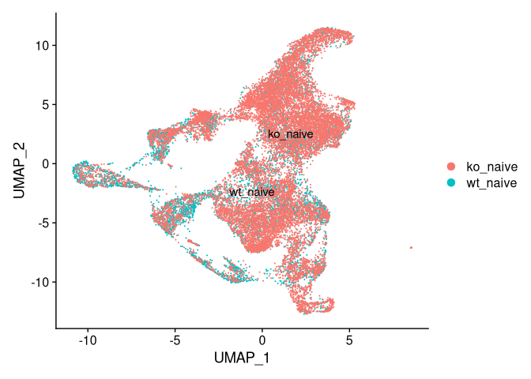<!-- -->

## We can start to identify clusters via Seurat!

### Pooled Cluster Plot


```r
renew_naive_integrated_UMAP <- function() {
  naive.integrated <- FindNeighbors(
                                  naive.integrated,
                                  reduction = "pca",
                                  dims = 1:30
  )
  naive.integrated <- FindClusters(naive.integrated, resolution = 0.5) %>% return()
  saveRDS(naive.integrated, "files/naive.integrated.UMAP.rds")
}
get_naive_integrated_UMAP <- function(force = FALSE) {
  if(!force & file.exists("files/naive.integrated.UMAP.rds")){
    naive.integrated <- readRDS("files/naive.integrated.UMAP.rds") %>% return()
  } else {
    naive.integrated <- renew_naive_integrated_UMAP() %>% return()
  }
}
naive.integrated <- get_naive_integrated_UMAP()

p2 <- DimPlot(naive.integrated, reduction = "umap", label = TRUE)
cowplot::plot_grid(p1, p2)
```

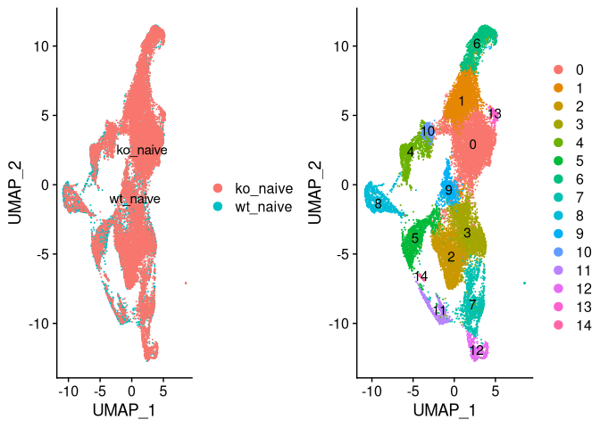<!-- -->

```r
p2
```

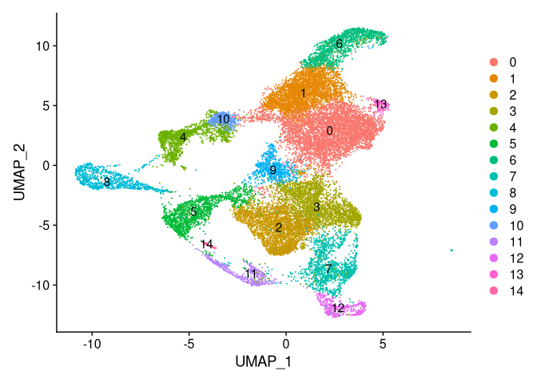<!-- -->

### Cluster by condition

```r
DimPlot(naive.integrated, reduction = "umap", split.by = "condition")
```

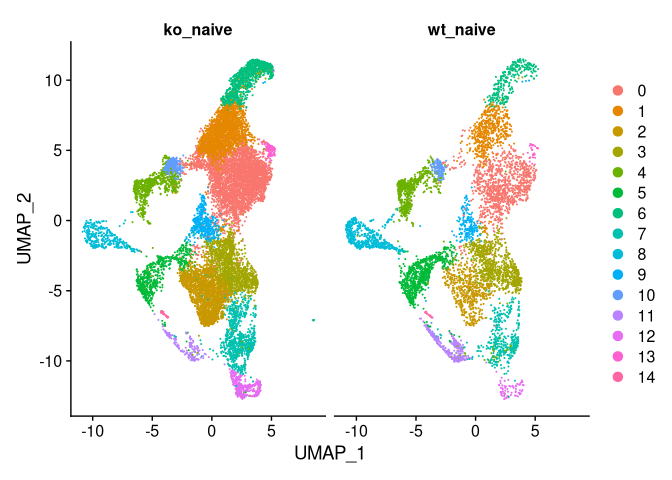<!-- -->

```r
(counts_by_cluster <- table(naive.integrated@meta.data$integrated_snn_res.0.5, 
                            naive.integrated@meta.data$condition))
```

```
##     
##      ko_naive wt_naive
##   0      3711      999
##   1      2471      546
##   2      2107      519
##   3      1557      879
##   4       766      659
##   5       609      785
##   6      1064      272
##   7       909      400
##   8       329      567
##   9       459      185
##   10      383      148
##   11      147      337
##   12      413       70
##   13      127       25
##   14       64       14
```

```r
write_tsv(data.frame(counts_by_cluster),
          file = "files/counts_by_cluster.tsv")
```

## Now we can plot the data and identify the gene expression in each of the clusters!

There are two primary ways to look at gene expression that I have found. 

### Looking per cluster at the highest expressed genes

The first is to ask what genes are most highly expressed in each cluster. 
This takes a while but gives a ton of data about which genes are determining cluster identity. 

The last table generated by this code called "naive.markers" seems to give a summary of what genes
are most responsible for determining the identity of each cluster. 
The command that generates this can be fed parameters for only looking genes that are 
positively correlated with a cluster identity, defining a minimum percentage expression within the cluster,
and defining a minimum log-fold-change over other clusters to give more or less restrictive results.
My list was generated to only identify genes that are positively correlated with a cluster identity,
are expressed in a minimum of 25 percent of the cells in the cluster, and are at least expressed 0.25 
log-fold-change higher within the cluster. 


```r
# Try to identify the cell type identities of the clusters
DefaultAssay(naive.integrated) <- "RNA"

# A function to get a dataframe of markers if one doesn't exist, or renew it if it does
# Also saves dataframe as both an rds and csv
renew_markers <- function(cluster_number) {
  markers <- FindConservedMarkers(
    naive.integrated,
    ident.1 = cluster_number,
    grouping.var = "condition",
    verbose = FALSE
  )
  write_rds(markers, str_c("./files/markers_rds/c", as.character(cluster_number), "markers.rds")) 
  write.csv(markers, 
    file = str_c("./files/csv_xlsx_files/c", as.character(cluster_number), "markers.csv"), 
    append = FALSE, row.names = TRUE)
  return(markers)
}

# Checks for an rds or renews the markers frame - set force = TRUE to renew all markers frames
get_markers <- function(cluster_number, force = FALSE) {
  markers_name = str_c("c", as.character(cluster_number), "markers")
  markers_file = str_c("./files/markers_rds/", markers_name, ".rds")
  if (!force & file.exists(markers_file)){
    markers <- read_rds(markers_file)
    return(markers)
  } else {
    markers <- renew_markers(cluster_number)
    return(markers)
  }
}


for (cluster in seq_along(levels(naive.integrated))) {
  markers <- get_markers(cluster - 1) 
  assign(str_c("c", as.character(cluster - 1), "markers"), markers, envir = .GlobalEnv)
}

c0markers_filtered <- c0markers[c0markers$wt_naive_pct.1 > 0.7 & c0markers$wt_naive_pct.2 < 0.7,]
head(c0markers_filtered)
```

```
##        wt_naive_p_val wt_naive_avg_logFC wt_naive_pct.1 wt_naive_pct.2
## Clec4d  1.720232e-213          0.9368841          0.870          0.519
## Lst1    1.995378e-151          0.7619648          0.851          0.645
## Dock10   1.920961e-29          0.4435840          0.746          0.680
## Cd68    1.148800e-112          0.6311869          0.866          0.674
## Card19  1.069034e-119          0.5875151          0.842          0.693
## F10      8.689163e-44          0.6572991          0.710          0.581
##        wt_naive_p_val_adj ko_naive_p_val ko_naive_avg_logFC ko_naive_pct.1
## Clec4d      2.957767e-209   0.000000e+00          0.6969278          0.892
## Lst1        3.430853e-147  1.115581e-277          0.5586259          0.825
## Dock10       3.302901e-25  5.843079e-257          0.7888004          0.717
## Cd68        1.975247e-108  3.767497e-248          0.5916928          0.803
## Card19      1.838096e-115  2.418859e-239          0.5727743          0.763
## F10          1.494015e-39  8.780598e-235          0.7369743          0.761
##        ko_naive_pct.2 ko_naive_p_val_adj      max_pval minimump_p_val
## Clec4d          0.733       0.000000e+00 1.720232e-213   0.000000e+00
## Lst1            0.715      1.918130e-273 1.995378e-151  2.231162e-277
## Dock10          0.595      1.004659e-252  1.920961e-29  1.168616e-256
## Cd68            0.667      6.477834e-244 1.148800e-112  7.534994e-248
## Card19          0.692      4.158986e-235 1.069034e-119  4.837717e-239
## F10             0.658      1.509736e-230  8.689163e-44  1.756120e-234
```

```r
c1markers_filtered <- c1markers[c1markers$wt_naive_pct.1 > 0.7 & c1markers$wt_naive_pct.2 < 0.6, ]
head(c1markers_filtered)
```

```
##         wt_naive_p_val wt_naive_avg_logFC wt_naive_pct.1 wt_naive_pct.2
## Csf3r     0.000000e+00           1.855398          0.824          0.166
## Cxcr2     0.000000e+00           1.632500          0.747          0.082
## Mmp9      0.000000e+00           1.605736          0.872          0.183
## Sell      0.000000e+00           1.472886          0.788          0.143
## Pglyrp1  2.611227e-208           1.118199          0.786          0.247
## Slfn1    2.557595e-204           1.296735          0.729          0.234
##         wt_naive_p_val_adj ko_naive_p_val ko_naive_avg_logFC ko_naive_pct.1
## Csf3r         0.000000e+00              0          1.8354566          0.890
## Cxcr2         0.000000e+00              0          1.6189756          0.688
## Mmp9          0.000000e+00              0          1.2719350          0.665
## Sell          0.000000e+00              0          1.3040014          0.615
## Pglyrp1      4.489745e-204              0          0.6234252          0.670
## Slfn1        4.397528e-200              0          1.2815761          0.677
##         ko_naive_pct.2 ko_naive_p_val_adj      max_pval minimump_p_val
## Csf3r            0.343                  0  0.000000e+00              0
## Cxcr2            0.132                  0  0.000000e+00              0
## Mmp9             0.249                  0  0.000000e+00              0
## Sell             0.186                  0  0.000000e+00              0
## Pglyrp1          0.295                  0 2.611227e-208              0
## Slfn1            0.287                  0 2.557595e-204              0
```

```r
c2markers_filtered <- c2markers[c2markers$wt_naive_pct.1 > 0.7 & c2markers$wt_naive_pct.2 < 0.6, ]
head(c2markers_filtered)
```

```
##        wt_naive_p_val wt_naive_avg_logFC wt_naive_pct.1 wt_naive_pct.2
## Cd36     0.000000e+00          1.5476255          0.906          0.232
## Mmp19    0.000000e+00          1.4303439          0.936          0.258
## Anpep    0.000000e+00          0.8724305          0.917          0.238
## Itgax   9.074890e-281          1.2192506          0.981          0.435
## Lpl     1.244749e-278          2.1184529          1.000          0.516
## Rnf128  1.158122e-275          0.8550737          0.757          0.146
##        wt_naive_p_val_adj ko_naive_p_val ko_naive_avg_logFC ko_naive_pct.1
## Cd36         0.000000e+00              0          1.6991462          0.915
## Mmp19        0.000000e+00              0          1.6348371          0.952
## Anpep        0.000000e+00              0          0.8124444          0.905
## Itgax       1.560337e-276              0          1.1716830          0.959
## Lpl         2.140222e-274              0          1.8982026          0.998
## Rnf128      1.991275e-271              0          0.7885583          0.828
##        ko_naive_pct.2 ko_naive_p_val_adj      max_pval minimump_p_val
## Cd36            0.172                  0  0.000000e+00              0
## Mmp19           0.260                  0  0.000000e+00              0
## Anpep           0.187                  0  0.000000e+00              0
## Itgax           0.266                  0 9.074890e-281              0
## Lpl             0.512                  0 1.244749e-278              0
## Rnf128          0.180                  0 1.158122e-275              0
```

```r
## Compare clusters to identify the most significant genes in determining their identity
renew_naive_markers = FALSE
if (!file.exists("./files/markers_rds/naive_markers.rds") | renew_naive_markers == TRUE) {
  naive.markers <- FindAllMarkers(naive.integrated, only.pos = TRUE, min.pct = 0.25, logfc.threshold = 0.25)
  write_rds(naive.markers, "./files/markers_rds/naive_markers.rds")
  write.csv(naive.markers, "./files/csv_xlsx_files/naive_markers.csv", row.names = TRUE, append = FALSE)
} else {
  naive.markers <- read_rds("./files/markers_rds/naive_markers.rds")
}
naive.markers %>% group_by(cluster) %>% top_n(n = 4, wt = avg_logFC) # top 4 cluster defining genes for each cluster
```

```
## # A tibble: 60 x 7
## # Groups:   cluster [15]
##        p_val avg_logFC pct.1 pct.2 p_val_adj cluster gene   
##        <dbl>     <dbl> <dbl> <dbl>     <dbl> <fct>   <chr>  
##  1 0.            0.950 0.799 0.619 0.        0       Thbs1  
##  2 0.            0.808 0.882 0.788 0.        0       Creg1  
##  3 2.58e-261     1.12  0.273 0.095 4.44e-257 0       Ear6   
##  4 1.04e-256     0.821 0.636 0.486 1.79e-252 0       Slc7a11
##  5 0.            1.89  0.878 0.287 0.        1       Csf3r  
##  6 0.            1.65  0.699 0.116 0.        1       Cxcr2  
##  7 0.            1.61  0.836 0.365 0.        1       Il1r2  
##  8 1.35e-298     1.45  0.413 0.167 2.32e-294 1       Ly6a   
##  9 0.            2.38  1     0.79  0.        2       Mmp12  
## 10 0.            1.97  0.998 0.513 0.        2       Lpl    
## # … with 50 more rows
```

## Comparing relative expression between closely related clusters

A similar method can be used to compare two clusters directly.
This can be helpful for determining identities of closely related clusters.


```r
# a function to generate the comparison table and save it to a csv 
comparison_markers <- function(cluster1, cluster2) {
  markers <- FindMarkers(naive.integrated, ident.1 = cluster1, ident.2 = cluster2, min.pct = 0.25) 
  write_rds(markers, str_c("./files/markers_rds/c", as.character(cluster1), "v", as.character(cluster2), "markers.rds")) 
  write.csv(markers, 
    file = str_c("./files/csv_xlsx_files/c", as.character(cluster1), "v", as.character(cluster2), "markers.csv"), 
    append = FALSE, row.names = TRUE)
  return(markers)
}

# Checks for an rds or renews the markers frame - set force = TRUE to renew all markers frames
get_comparison_markers <- function(cluster1, cluster2, force = FALSE) {
  markers_name = str_c("c", as.character(cluster1), "v", as.character(cluster2), "markers")
  markers_file = str_c("./files/markers_rds/", markers_name, ".rds")
  if (!force & file.exists(markers_file)){
    markers <- read_rds(markers_file)
    return(markers)
  } else {
    markers <- comparison_markers(cluster1, cluster2)
    return(markers)
  }
}

c2v3markers <- get_comparison_markers(2, 3)
c0v1markers <- get_comparison_markers(0, 1)
c5v8markers <- get_comparison_markers(5, 8)
c1v6markers <- get_comparison_markers(1, 6)
```


### Looking at expression of predetermined genes

The second is by asking what the expression profile is of makers that we know are associated with different cell types.
This can also be used to visualize differentially epxressed genes separated by condition.
For example, the plots of antigen presentation genes towards the end were differentially expressed by bulk RNAseq.


```r
## Plot gene expression by feature - way faster!
p_macs <- FeaturePlot(naive.integrated, features = c("Cd14", "Cd68", "Cd62l", "Cd31", "Cx3cr1", "Ace", "Ccr2", "Lyz2", "Lpl"), min.cutoff = "q9")
```

```
## Warning in FetchData(object = object, vars = c(dims, "ident", features), : The
## following requested variables were not found: Cd62l, Cd31
```

```r
p_macs
```

<!-- -->

```r
(p_PMN_1 <- FeaturePlot(naive.integrated, features = c("Clec4d", "S100a8"), split.by = "condition", min.cutoff = "q9"))
```

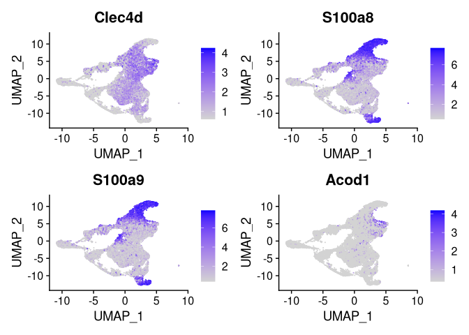<!-- -->

```r
(p_PMN_2 <- FeaturePlot(naive.integrated, features = c("S100a9", "Acod1"), split.by = "condition", min.cutoff = "q9"))
```

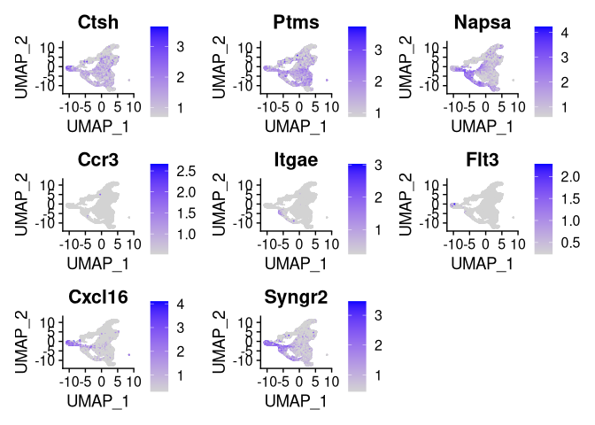<!-- -->

```r
(p_DC <- FeaturePlot(naive.integrated, features = c("Ctsh", "Ptms", "Napsa", "Ccr3", "Itgae","Flt3","Cxcl16", "Syngr2"), min.cutoff = "q9"))
```

<!-- -->

```r
(p_AgPres_1 <- FeaturePlot(naive.integrated, features = c("Ctse", "Hfe", "H2-Oa"), split.by = "condition"))
```

<!-- -->

```r
(p_AgPres_2 <- FeaturePlot(naive.integrated, features = c("Trem2", "Rab5b", "Rab4a"), split.by = "condition"))
```

<!-- -->

```r
(pnew <- FeaturePlot(naive.integrated, features = c("H2-Ab1", "H2-Ob"), split.by = "condition"))
```

<!-- -->

## Differential expression analysis

Now it is time for differential expression analysis! I am thinking about approaching it in two ways: 

* A differential expression gene table

* A volcano style-plot

### Generating the differential expression tables


```r
naive.integrated$celltype.condition <- paste(Idents(naive.integrated), naive.integrated$condition, sep = "_")
naive.integrated$celltype <- Idents(naive.integrated)
Idents(naive.integrated) <- "celltype.condition" # changes levels in naive integrated to one per cluster per condition

# A function to generate the differential expression table, assign it to a global variable, and save a csv
cluster_differential <- function(cluster) {
  differential_name = str_c("c", as.character(cluster), "_differential")
  differential_file_name = str_c("./files/csv_xlsx_files/", differential_name, ".csv")
  differential <- FindMarkers(naive.integrated, ident.1 = str_c(as.character(cluster), "_wt_naive"), 
                               ident.2 = str_c(as.character(cluster), "_ko_naive"), verbose = FALSE)
  write.csv(differential, file = differential_file_name, append = FALSE, row.names = TRUE)
  assign(differential_name, differential, envir = .GlobalEnv)
}

for (cluster_plus_one in seq_along(levels(naive.integrated$seurat_clusters))) {
  cluster_differential(cluster_plus_one - 1)
}
```

```
## Warning in write.csv(differential, file = differential_file_name, append =
## FALSE, : attempt to set 'append' ignored

## Warning in write.csv(differential, file = differential_file_name, append =
## FALSE, : attempt to set 'append' ignored

## Warning in write.csv(differential, file = differential_file_name, append =
## FALSE, : attempt to set 'append' ignored

## Warning in write.csv(differential, file = differential_file_name, append =
## FALSE, : attempt to set 'append' ignored

## Warning in write.csv(differential, file = differential_file_name, append =
## FALSE, : attempt to set 'append' ignored

## Warning in write.csv(differential, file = differential_file_name, append =
## FALSE, : attempt to set 'append' ignored

## Warning in write.csv(differential, file = differential_file_name, append =
## FALSE, : attempt to set 'append' ignored

## Warning in write.csv(differential, file = differential_file_name, append =
## FALSE, : attempt to set 'append' ignored

## Warning in write.csv(differential, file = differential_file_name, append =
## FALSE, : attempt to set 'append' ignored

## Warning in write.csv(differential, file = differential_file_name, append =
## FALSE, : attempt to set 'append' ignored

## Warning in write.csv(differential, file = differential_file_name, append =
## FALSE, : attempt to set 'append' ignored

## Warning in write.csv(differential, file = differential_file_name, append =
## FALSE, : attempt to set 'append' ignored

## Warning in write.csv(differential, file = differential_file_name, append =
## FALSE, : attempt to set 'append' ignored

## Warning in write.csv(differential, file = differential_file_name, append =
## FALSE, : attempt to set 'append' ignored

## Warning in write.csv(differential, file = differential_file_name, append =
## FALSE, : attempt to set 'append' ignored
```

### Generating volcano-style plots


```r
# A function to plot the differential expression in a volcano style plot with genes labeled
plot_cluster <- function(cluster, genes = c("Bhlhe40")) {
    Idents(naive.integrated) <- "celltype"
    cluster_subset <- subset(naive.integrated, idents = as.character(cluster))
    Idents(cluster_subset) <- "condition"
    avg_exp <- as.data.frame(log1p(AverageExpression(cluster_subset, verbose = FALSE)$RNA))
    avg_exp$gene <- rownames(avg_exp)

    cluster_plot <- ggplot(avg_exp, aes(wt_naive, ko_naive)) +
        geom_point() +
        ggtitle(paste("cluster", as.character(cluster), sep = " "))
    cluster_plot <- LabelPoints(
                                cluster_plot,
                                points = genes,
                                repel = TRUE
    )
    cluster_plot
}

# TODO: generate these scatter plots in a function - challenging because there are different genes to label for each
```

### Cluster 0


```r
# Look at the beginning of the differential expression file to choose genes to label
head(c0_differential, 10)
```

```
##                 p_val avg_log2FC pct.1 pct.2     p_val_adj
## Bhlhe40 6.954264e-160  0.8678252 0.733 0.251 1.195716e-155
## Rps3a1  4.709849e-137  0.7031419 0.984 0.941 8.098114e-133
## Rps7    1.049153e-132  0.9098732 0.961 0.829 1.803914e-128
## Rpl9    8.982399e-132  0.7980198 0.954 0.848 1.544434e-127
## Rpl5    1.290399e-124  0.8033348 0.955 0.810 2.218712e-120
## Rpl23   2.399503e-119  0.7154277 0.985 0.947 4.125706e-115
## Rps24   4.191520e-119  0.6770843 0.986 0.938 7.206900e-115
## Rpl17   4.120666e-118  0.7594295 0.978 0.908 7.085073e-114
## Rps3    2.246752e-117  0.7461790 0.961 0.869 3.863065e-113
## Abcd2   4.891208e-116  0.3740394 0.308 0.051 8.409943e-112
```

```r
genes_to_label <- c("Bhlhe40", "Rps3a1", "Rps7", "Rp19")

p_c0 <- plot_cluster(0, genes_to_label)
plot_grid(p2, p_c0) # p2 is included to give reference to which cluster we are looking into
```

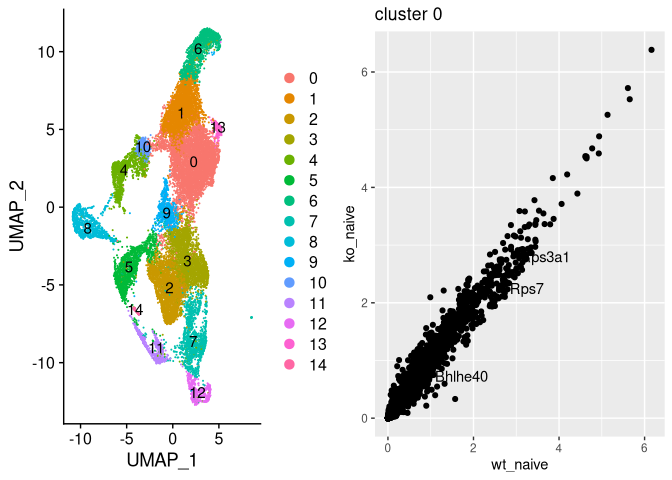<!-- -->


### Cluster 1


```r
head(c1_differential, 10)
```

```
##               p_val avg_log2FC pct.1 pct.2    p_val_adj
## Apoe   7.749334e-86  2.4145757 0.266 0.028 1.332421e-81
## Mmp12  1.216946e-78 -1.6177662 0.311 0.661 2.092417e-74
## Dhrs3  1.745614e-59  0.4609814 0.216 0.028 3.001408e-55
## Rpl9   3.778507e-59  0.7262008 0.943 0.764 6.496765e-55
## Scd2   4.687399e-51  0.7837956 0.430 0.140 8.059515e-47
## Adgre5 6.037115e-50  0.4828172 0.198 0.029 1.038022e-45
## Rps11  5.778174e-48  0.6960070 0.974 0.816 9.934992e-44
## Trf    2.671131e-46  0.8962533 0.518 0.208 4.592743e-42
## Rps27a 8.177961e-46  0.6001518 0.985 0.909 1.406119e-41
## Fau    1.492318e-45  0.5430758 1.000 0.987 2.565891e-41
```

```r
genes_to_label <- c("Apoe", "Mmp12", "Dhrs3", "Rp19")
p_c1 <- plot_cluster(1, genes_to_label)
plot_grid(p2, p_c1)
```

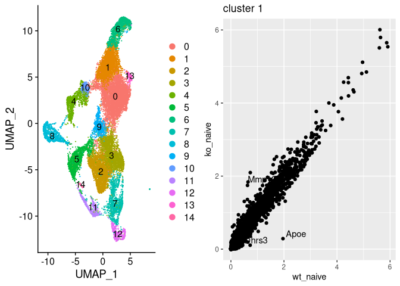<!-- -->


### Cluster 2


```r
head(c2_differential, n = 10)
```

```
##                  p_val avg_log2FC pct.1 pct.2     p_val_adj
## Bhlhe40  3.378246e-183  1.1317528 0.934 0.493 5.808555e-179
## AA467197 3.913614e-169  2.1850590 0.992 0.770 6.729068e-165
## Ccl2     2.648943e-140 -2.3093511 0.551 0.955 4.554593e-136
## Vim      1.961268e-132 -0.8734808 0.996 1.000 3.372203e-128
## S100a9   2.043107e-115 -1.3454360 0.705 0.917 3.512918e-111
## Klk1b1   3.976240e-112  0.7401887 0.514 0.099 6.836747e-108
## Klk1b11  1.413795e-111  1.1877814 0.580 0.138 2.430880e-107
## S100a6   1.465303e-110 -0.9605135 0.983 0.997 2.519442e-106
## Ccl7     1.149144e-108 -2.1159719 0.135 0.683 1.975838e-104
## Rgl1      2.755901e-98 -0.9628175 0.590 0.881  4.738495e-94
```

```r
genes_to_label <- c("Bhlhe40", "AA467197", "Ccl2", "Vim", "S100a9")

p_c2 <- plot_cluster(2, genes_to_label)
plot_grid(p2, p_c2)
```

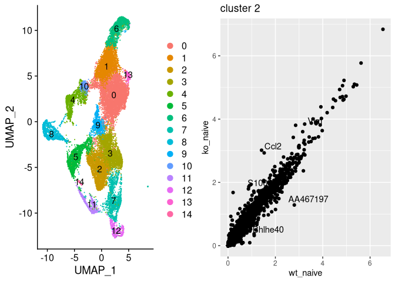<!-- -->


### Cluster 3


```r
head(c3_differential, n = 10)
```

```
##                p_val avg_log2FC pct.1 pct.2     p_val_adj
## Ccl2   8.571257e-229 -2.8126762 0.216 0.874 1.473742e-224
## Rps9   6.921446e-165  0.8341779 0.999 0.999 1.190073e-160
## Rps27a 2.995029e-160  0.6198376 1.000 0.999 5.149653e-156
## Rbpms  8.698002e-152  0.6171149 0.712 0.178 1.495534e-147
## Rpl5   1.703785e-150  0.7508364 0.995 0.985 2.929488e-146
## Rps3a1 4.921082e-150  0.6157922 1.000 0.999 8.461309e-146
## Rps14  2.115263e-149  0.7731042 1.000 0.997 3.636984e-145
## Axl    2.787599e-149  1.1187983 0.904 0.477 4.792998e-145
## Rpl17  1.160402e-147  0.7688347 1.000 0.995 1.995196e-143
## Emp1   1.018207e-145 -1.0298150 0.317 0.770 1.750706e-141
```

```r
genes_to_label <- c("Ccl2", "Rps9", "Rps27a", "Rbpms", "Rpl5")

p_c3 <- plot_cluster(3, genes_to_label)
plot_grid(p2, p_c3)
```

<!-- -->


### Cluster 4


```r
head(c4_differential, n = 10)
```

```
##                 p_val avg_log2FC pct.1 pct.2    p_val_adj
## Ccl2     7.483327e-62 -2.2960990 0.115 0.521 1.286683e-57
## AA467197 1.983385e-52  1.7119817 0.654 0.292 3.410232e-48
## Mmp12    5.017082e-47 -1.8865632 0.574 0.842 8.626370e-43
## Rpl32    8.921177e-47  0.9083533 0.930 0.808 1.533907e-42
## Rps7     8.265880e-45  1.1728444 0.833 0.578 1.421235e-40
## Rps14    1.107081e-44  0.9775564 0.900 0.731 1.903515e-40
## Tmsb4x   1.132870e-42  0.5686719 0.998 0.995 1.947857e-38
## Rps3a1   1.786508e-41  0.8206750 0.917 0.807 3.071722e-37
## Rpl23    9.184313e-41  0.7512280 0.954 0.858 1.579151e-36
## Rpl17    1.159263e-40  0.9639170 0.879 0.704 1.993236e-36
```

```r
genes_to_label <- c("Ccl2", "AA467197", "Mmp12", "Rpl32", "Rps7")

p_c4 <- plot_cluster(4, genes_to_label)
plot_grid(p2, p_c4)
```

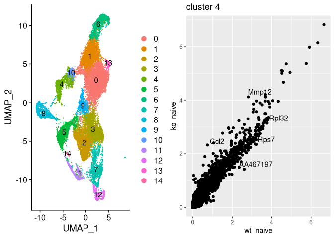<!-- -->

### Cluster 5


```r
head(c5_differential, n = 10)
```

```
##                 p_val avg_log2FC pct.1 pct.2     p_val_adj
## Hpgds   1.527173e-164 -1.4089621 0.215 0.887 2.625822e-160
## Lmna    2.764033e-136 -1.3756792 0.460 0.897 4.752478e-132
## Bhlhe40 3.315825e-127  1.0240315 0.938 0.534 5.701229e-123
## Angptl2 1.042759e-117 -0.9983361 0.122 0.688 1.792920e-113
## Crip1   4.611598e-102  1.5558339 0.955 0.706  7.929181e-98
## Klk1b11  2.297853e-95  1.9865299 0.884 0.407  3.950928e-91
## Cdkn1a   1.078654e-94 -1.3363006 0.810 0.977  1.854638e-90
## Mrfap1   2.589254e-92  0.9786295 0.977 0.918  4.451963e-88
## Sdc4     5.597997e-90 -1.0533504 0.162 0.655  9.625196e-86
## Trf      1.978515e-89  0.9918260 0.935 0.650  3.401860e-85
```

```r
genes_to_label <- c("Hpgds", "Lmna", "Bhlhe40", "Angptl2", "Crip1")

p_c5 <- plot_cluster(5)
plot_grid(p2, p_c5)
```

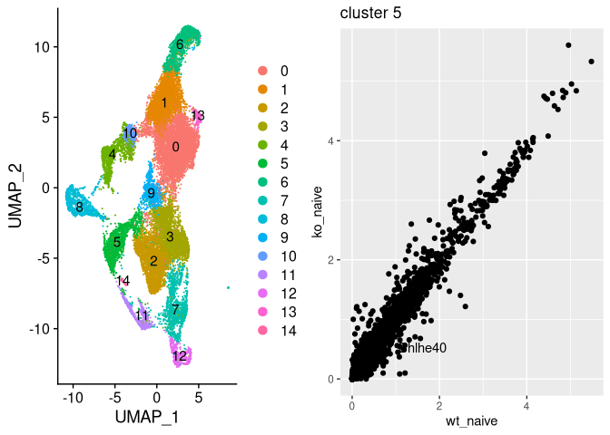<!-- -->

### Cluster 6


```r
head(c6_differential, n = 10)
```

```
##                 p_val avg_log2FC pct.1 pct.2    p_val_adj
## Mmp12    9.548411e-43 -1.3056074 0.335 0.727 1.641754e-38
## Apoe     2.711194e-31  1.6653988 0.199 0.019 4.661627e-27
## Lyz2     5.814871e-31  0.8340416 1.000 0.987 9.998089e-27
## Prdx5    8.847032e-29  0.5535227 0.993 0.964 1.521159e-24
## Nov      4.758120e-27 -1.1330941 0.382 0.719 8.181111e-23
## Arhgap24 4.961666e-22  0.4317619 0.257 0.058 8.531089e-18
## Klhl24   1.287542e-21  0.4888593 0.522 0.206 2.213800e-17
## Ypel3    2.552217e-20  0.6141927 0.868 0.605 4.388282e-16
## Txn1     4.984508e-20  0.6076122 0.963 0.870 8.570362e-16
## Rpl18a   6.087111e-20  0.5873429 0.982 0.858 1.046618e-15
```

```r
genes_to_label <- c("Mmp12", "Apoe", "Lyz2", "Prdx5")

p_c6 <- plot_cluster(6, genes_to_label)
plot_grid(p2, p_c6)
```

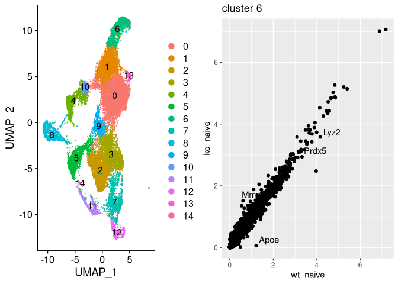<!-- -->


### Cluster 7


```r
head(c7_differential, n = 10)
```

```
##                  p_val avg_log2FC pct.1 pct.2     p_val_adj
## Bhlhe40  4.543844e-114  1.1368081 0.950 0.488 7.812686e-110
## S100a9    1.175195e-83 -2.5848800 0.728 0.936  2.020630e-79
## Ccl2      1.690272e-80 -2.0474498 0.380 0.872  2.906254e-76
## Clec4d    9.277244e-75 -1.0585599 0.845 0.952  1.595129e-70
## Hpgds     6.369496e-71 -0.7497953 0.358 0.760  1.095171e-66
## AA467197  1.423884e-70  1.7330329 0.945 0.699  2.448226e-66
## Axl       5.339681e-66  0.8919086 0.915 0.557  9.181048e-62
## Rbpms     1.418615e-61  0.3742761 0.682 0.190  2.439166e-57
## Ccl7      5.544445e-55 -1.4801036 0.065 0.514  9.533119e-51
## Tmsb4x    7.100147e-52  0.4281685 1.000 1.000  1.220799e-47
```

```r
genes_to_label <- c("Bhlhe40", "S100a9", "Ccl2", "Clec4d", "Hpgds")

p_c7 <- plot_cluster(7, genes_to_label)
plot_grid(p2, p_c7)
```

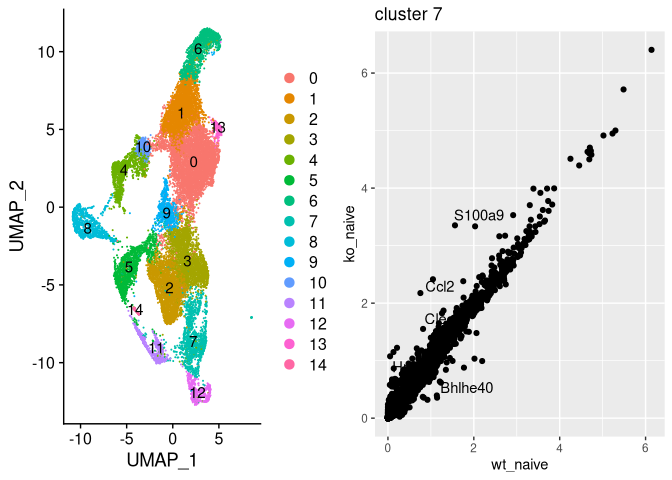<!-- -->

### Cluster 8


```r
head(c8_differential, n = 10)
```

```
##                  p_val avg_log2FC pct.1 pct.2    p_val_adj
## Sphk1    1.486203e-101 -1.5416166 0.113 0.775 2.555378e-97
## AA467197  3.177189e-72  1.8283161 0.961 0.717 5.462859e-68
## Bhlhe40   6.090276e-69  1.0779893 0.944 0.772 1.047162e-64
## Mmp12     3.736333e-68 -1.9217356 0.559 0.912 6.424252e-64
## Satb1     1.525196e-65 -1.3636047 0.092 0.596 2.622422e-61
## Ninj1     1.153600e-59 -1.0565825 0.619 0.863 1.983500e-55
## Ndufa4    4.931661e-58 -0.9842408 0.711 0.866 8.479497e-54
## Psap      1.232995e-50 -1.2644850 0.965 0.988 2.120012e-46
## Mrfap1    1.539631e-48  1.0474065 0.966 0.891 2.647242e-44
## Malt1     1.156163e-47 -1.2570898 0.713 0.897 1.987906e-43
```

```r
genes_to_label <- c("Sphk1", "AA467197", "Bhlhe40", "Mmp12")

p_c8 <- plot_cluster(8, genes_to_label)
plot_grid(p2, p_c8)
```

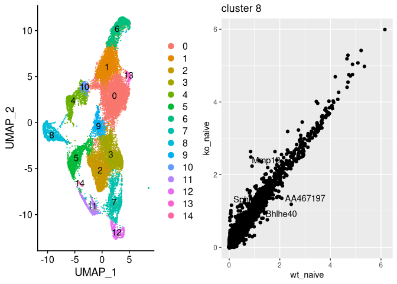<!-- -->


### Cluster 9


```r
head(c9_differential, n = 10)
```

```
##                 p_val avg_log2FC pct.1 pct.2    p_val_adj
## Rbpms    1.039109e-41  0.5938641 0.654 0.122 1.786645e-37
## Nov      3.980935e-39 -1.4118806 0.605 0.939 6.844820e-35
## S100a6   8.740415e-39 -1.1122251 0.962 1.000 1.502827e-34
## Heatr1   1.219463e-37 -0.8973321 0.411 0.819 2.096745e-33
## Trf      6.932017e-37  1.3355462 0.919 0.475 1.191891e-32
## Emilin2  4.106133e-30 -0.7736289 0.924 0.991 7.060085e-26
## Bhlhe40  1.070350e-29  0.8188353 0.778 0.383 1.840360e-25
## Ccl2     9.492188e-29 -1.9115459 0.108 0.564 1.632087e-24
## AW112010 8.641940e-28  0.8588965 0.676 0.229 1.485895e-23
## Rps7     3.783464e-27  0.5426889 1.000 1.000 6.505287e-23
```

```r
genes_to_label <- c("Rbpms", "Nov", "S100a6", "Heatr1", "Trf")

p_c9 <- plot_cluster(9, genes_to_label)
plot_grid(p2, p_c9)
```

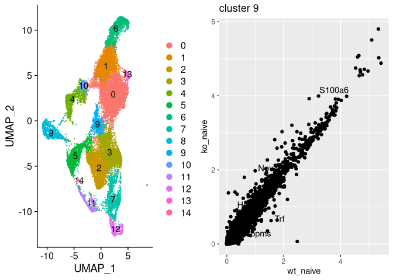<!-- -->


### Cluster 10


```r
head(c10_differential, n = 10)
```

```
##                p_val avg_log2FC pct.1 pct.2    p_val_adj
## Fth1    3.912476e-29 -0.8865348 1.000 1.000 6.727110e-25
## Ftl1    1.041726e-23 -0.9379561 0.973 0.990 1.791143e-19
## Lgals3  7.679980e-22 -1.0744674 0.858 0.977 1.320496e-17
## Bhlhe40 4.253901e-14  0.7574497 0.236 0.029 7.314157e-10
## Vim     6.097447e-14 -1.1097522 0.568 0.757 1.048395e-09
## S100a6  1.430993e-13 -1.0089533 0.520 0.721 2.460450e-09
## Ccl6    3.958499e-13 -0.4901989 0.818 0.958 6.806244e-09
## Prdx1   1.554256e-12 -1.0535129 0.608 0.799 2.672388e-08
## Wfdc17  3.565152e-12 -0.8276473 0.750 0.888 6.129922e-08
## Mmp12   3.723497e-12 -0.8342732 0.764 0.924 6.402181e-08
```

```r
genes_to_label <- c("Fth1", "Ftl1", "Lgals3", "Bhlhe40", "Vim")

p_c10 <- plot_cluster(10, genes_to_label)
plot_grid(p2, p_c10)
```

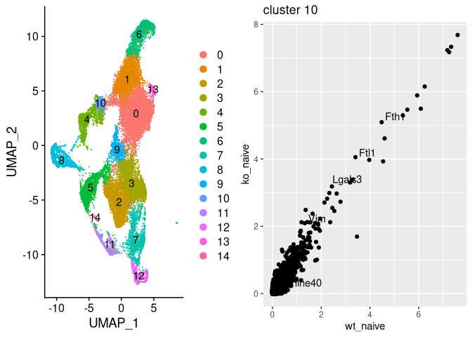<!-- -->


### Cluster 11


```r
head(c11_differential, n = 10)
```

```
##                 p_val avg_log2FC pct.1 pct.2    p_val_adj
## Hpgds    1.337129e-49 -1.3539468 0.309 0.857 2.299060e-45
## Bhlhe40  3.449034e-47  1.0862761 0.964 0.578 5.930269e-43
## Lmna     1.372641e-38 -1.1771955 0.558 0.912 2.360120e-34
## AA467197 2.748202e-32  1.5056603 0.855 0.395 4.725259e-28
## Psap     1.249782e-30 -0.9729481 1.000 1.000 2.148875e-26
## Cldnd1   2.989231e-30  1.2472140 0.950 0.701 5.139683e-26
## Sdc4     4.179671e-30 -0.5080958 0.053 0.476 7.186527e-26
## Angptl2  5.609954e-29 -0.7561776 0.338 0.776 9.645755e-25
## Crip1    2.318548e-27  1.4529645 0.944 0.823 3.986511e-23
## Scp2     5.537610e-27 -0.5984817 0.985 1.000 9.521367e-23
```

```r
genes_to_label <- c("Hpgds", "Bhlhe40", "Lmna", "AA467197", "Psap")

p_c11 <- plot_cluster(11, genes_to_label)
plot_grid(p2, p_c11)
```

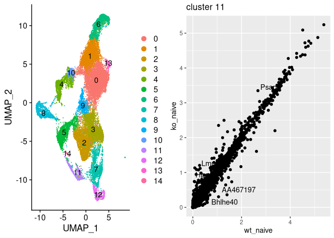<!-- -->


### Cluster 12


```r
head(c12_differential, n = 10)
```

```
##                p_val avg_log2FC pct.1 pct.2    p_val_adj
## Mmp12   5.046758e-20 -1.0651810 0.614 0.910 8.677396e-16
## Gpnmb   6.247396e-09 -0.6444555 0.357 0.680 1.074177e-04
## Klhl24  4.128074e-08  0.3759415 0.586 0.242 7.097811e-04
## Adgre5  1.772135e-07  0.3967847 0.629 0.288 3.047010e-03
## Nov     2.289196e-07 -0.6602333 0.386 0.649 3.936044e-03
## Rpl41   7.166714e-07 -0.4810405 0.986 1.000 1.232245e-02
## H3f3a   7.919406e-07  0.3424165 1.000 1.000 1.361663e-02
## Bhlhe40 1.259625e-06  0.3723984 0.557 0.271 2.165798e-02
## Arl11   1.637880e-06  0.3562009 0.857 0.530 2.816170e-02
## Atp5k   5.077538e-06 -0.3894600 0.900 0.939 8.730319e-02
```

```r
genes_to_label <- c("Mmp12", "Gpnmb", "Klhl24", "Adgre5", "Nov")

p_c12 <- plot_cluster(12, genes_to_label)
plot_grid(p2, p_c12)
```

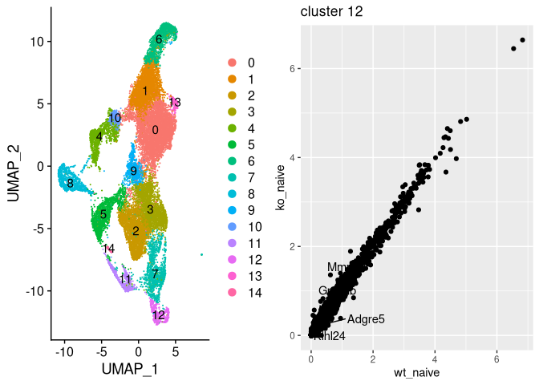<!-- -->


### Cluster 13


```r
head(c13_differential, n = 10)
```

```
##                p_val avg_log2FC pct.1 pct.2    p_val_adj
## Bhlhe40 2.855784e-16  2.7605205  0.88 0.165 4.910236e-12
## Elp5    1.054790e-08  0.8136950  0.40 0.031 1.813605e-04
## Rab10   2.130151e-07  0.9460673  0.80 0.268 3.662582e-03
## Mocos   4.313562e-07  0.4216606  0.28 0.016 7.416738e-03
## Mmp12   1.925518e-06 -1.5900555  0.44 0.819 3.310736e-02
## Ilkap   2.638766e-06  0.4395104  0.52 0.102 4.537093e-02
## Azi2    2.739080e-06  0.5138003  0.44 0.079 4.709573e-02
## Tnks2   3.057715e-06  0.6780865  0.56 0.134 5.257435e-02
## Glg1    3.149959e-06  0.7146681  0.52 0.118 5.416040e-02
## Snx30   4.827033e-06  0.7538195  0.36 0.055 8.299601e-02
```

```r
genes_to_label <- c("Bhlhe40", "Elp5", "Rab10", "Mocos", "Mmp12")

p_c13 <- plot_cluster(13, genes_to_label)
plot_grid(p2, p_c13)
```

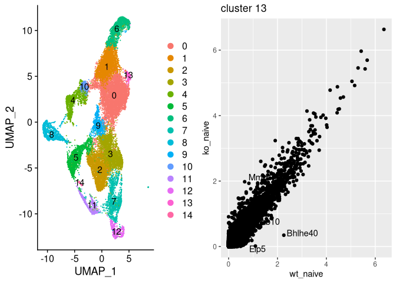<!-- -->


### Cluster 14


```r
head(c14_differential, n = 10)
```

```
##                p_val avg_log2FC pct.1 pct.2  p_val_adj
## Isoc2b  1.001353e-06  0.2888960 0.357 0.000 0.01721726
## Rundc1  1.255170e-05  0.6454918 0.357 0.016 0.21581401
## Ctse    1.405000e-05  0.2738679 0.286 0.000 0.24157574
## Cebpb   2.540184e-05 -1.5608380 0.429 0.906 0.43675919
## Lsm11   3.102335e-05  0.6039375 0.429 0.047 0.53341545
## Kdelr1  1.178642e-04  1.4727002 0.786 0.297 1.00000000
## Lgals1  1.552543e-04 -1.4809243 0.857 0.984 1.00000000
## Zfp12   1.900117e-04  0.2634860 0.214 0.000 1.00000000
## Parp8   1.900117e-04  0.5403527 0.214 0.000 1.00000000
## Gm20045 1.945194e-04  0.2750020 0.286 0.016 1.00000000
```

```r
genes_to_label <- c("Rundc1", "Cebpb", "Lsm11", "Kdelr1", "Lgals1")

p_14 <- plot_cluster(14, genes_to_label)
plot_grid(p2, p_14)
```

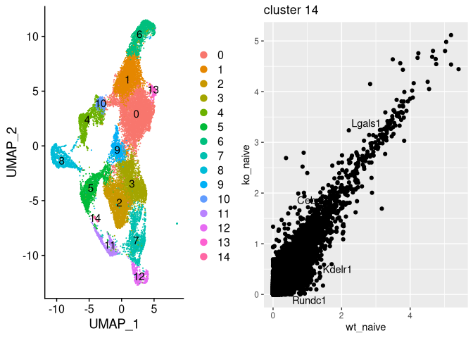<!-- -->

## Violin Plots


```r
plots <- VlnPlot(naive.integrated, features = c("Bhlhe40", "Kit", "H2-Ab1", "H2-Ob"), 
                 split.by = "condition", group.by = "celltype", pt.size =0, combine = FALSE)

for (i in seq_along(plots)){
  print(plots[i])
  
}
```

```
## [[1]]
```

<!-- -->

```
## 
## [[1]]
```

<!-- -->

```
## 
## [[1]]
```

<!-- -->

```
## 
## [[1]]
```

<!-- -->

## An attempt at pseudotime analysis

This requires the SeuratWrappers library and Monocle3.
It is pretty easy to generate!
I need to read/experiment more to know how to modify the way that Monocle3 clusters and partitions.
For example, I want to try to partition by what we think the cells are.
For now, I have used the cluster with maximal c-kit expression as the root (time 0) of the analysis.


```r
cds <- as.cell_data_set(naive.integrated)
cds <- cluster_cells(cds)
p_monocle_clusters <- plot_cells(cds, show_trajectory_graph = FALSE) + ggtitle("Monocle3's Clusters")
```

```
## Warning: The `add` argument of `group_by()` is deprecated as of dplyr 1.0.0.
## Please use the `.add` argument instead.
```

```r
p_monocle_partitions <- plot_cells(cds, color_cells_by = "partition", show_trajectory_graph = FALSE) + ggtitle("Monocle3's Partitions")
wrap_plots(p_monocle_clusters, p_monocle_partitions) 
```

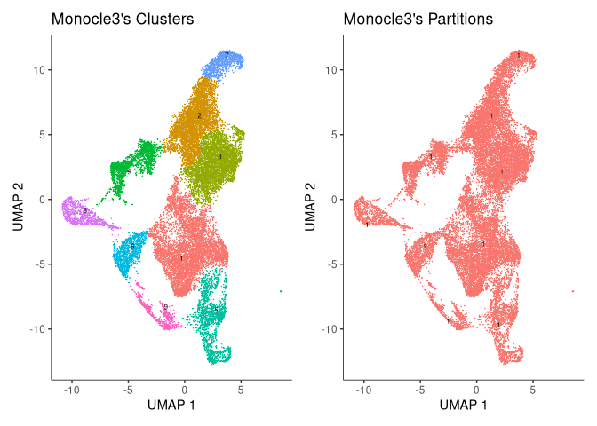<!-- -->

```r
integrated.sub <- subset(as.Seurat(cds), monocle3_partitions == 1)
cds <- as.cell_data_set(integrated.sub)
cds <- learn_graph(cds)
```

```
## 
  |                                                                            
  |                                                                      |   0%
  |                                                                            
  |======================================================================| 100%
```

```r
plot_cells(cds, label_groups_by_cluster = FALSE, label_leaves = FALSE, label_branch_points = FALSE)
```

```
## Warning: `select_()` was deprecated in dplyr 0.7.0.
## Please use `select()` instead.
```

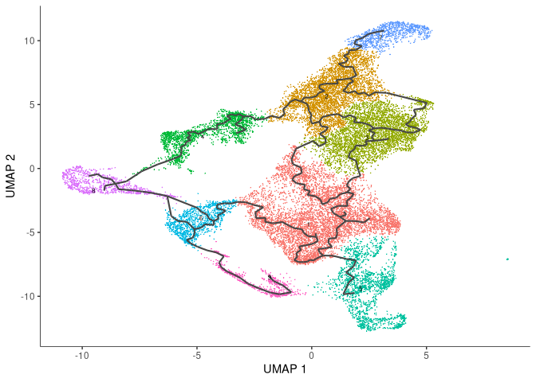<!-- -->

```r
# Set max Kit expression as the root of our pseudotime tree
max.kit <- which.max(unlist(FetchData(integrated.sub, "Kit")))
max.kit <- colnames(integrated.sub)[max.kit]
cds <- order_cells(cds, root_cells = max.kit)
plot_cells(cds, color_cells_by = "pseudotime", label_cell_groups = FALSE, label_leaves = FALSE, 
           label_branch_points = TRUE) +
            ggtitle("Pseudotime map with max Kit expression as root")
```

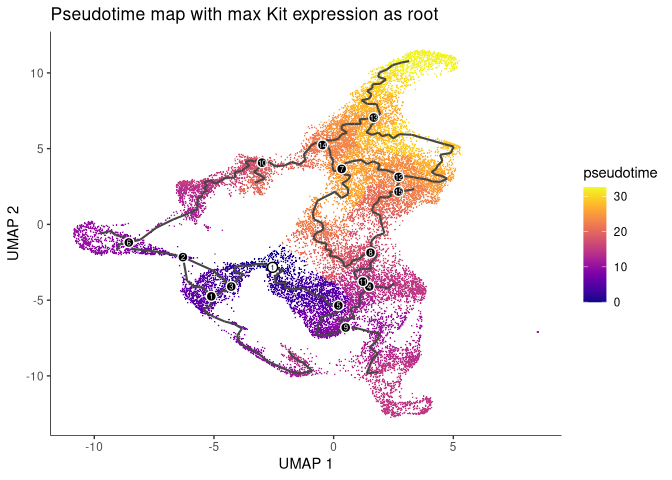<!-- -->

```r
# Set the assay back as 'integrated'
integrated.sub <- as.Seurat(cds, assay = "integrated")
p_pseudotime <- FeaturePlot(integrated.sub, "monocle3_pseudotime")
wrap_plots(p2, p_pseudotime)
```

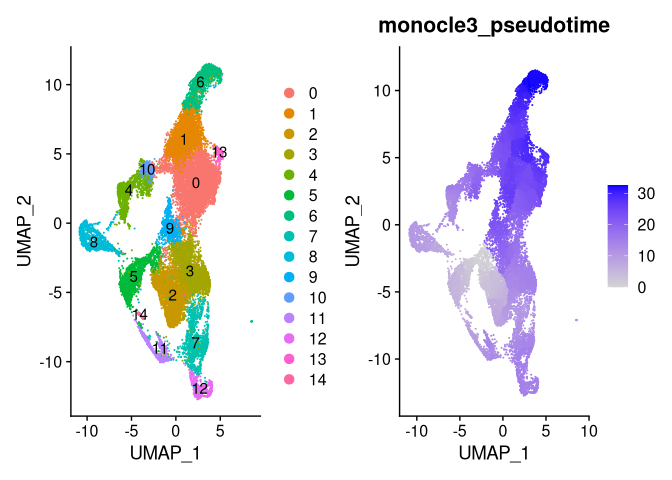<!-- -->

It looks like cluster 6 and 13 are very mature, which fits with our interpretation of them as mature PMNs. That is all I really can say. It looks like there may be two distinct paths forward in pseudotime? The one to the left would fit with the interpretation that those clusters are DC like. The one to the right is fuzzier, expecially because given cell-types don't cluster as nicely. It looks like cluster 12 may be a less mature PMN cluster. And maybe cluster 9 is a mature macrophage like cluster (expresses Ccr2 highly)? It is a bit weird that clusters 0 and 1 have multiple pseudotimes attributed to them. I don't know what that means. I also need to better understand the significance of the branch points. Let me know if you have any questions! That will help guide what I learn about!  

## A stab at trajectory analysis using scVelo

This is a package recommended by the Bryson lab.
It performs an alternative to pseudotime without requiring a starting gene. 
I will learn more as we go!

scVelo is an RNA velocity method based on comparing the counts of spliced and unspliced gene reads to determine how fast expression is changing. 
It requires pre-processing of the bam files using velocyto,
which generates .loom files.
These can be read into Seurat and the rest of the workflow should be the same.

Here is an example of a shortened, unintegrated workflow using just the Naive WT cells.


```r
library(SeuratDisk)
# Test of pipeline
ldat <- ReadVelocity(file = "velocyto/WT_Naive/results/velocyto/results.loom")
wt_vel <- as.Seurat(x = ldat)
```

```
## Warning: Non-unique features (rownames) present in the input matrix, making
## unique
```

```r
wt_vel[["RNA"]] <-wt_vel[["spliced"]]
```

```
## Warning: Cannot add objects with duplicate keys (offending key: spliced_),
## setting key to 'rna_'
```

```r
wt_vel <- SCTransform(wt_vel, verbose = FALSE)
```

```
## Warning in theta.ml(y = y, mu = fit$fitted): iteration limit reached
```

```
## Warning in theta.ml(y = y, mu = fit$fitted): iteration limit reached

## Warning in theta.ml(y = y, mu = fit$fitted): iteration limit reached

## Warning in theta.ml(y = y, mu = fit$fitted): iteration limit reached

## Warning in theta.ml(y = y, mu = fit$fitted): iteration limit reached

## Warning in theta.ml(y = y, mu = fit$fitted): iteration limit reached

## Warning in theta.ml(y = y, mu = fit$fitted): iteration limit reached

## Warning in theta.ml(y = y, mu = fit$fitted): iteration limit reached

## Warning in theta.ml(y = y, mu = fit$fitted): iteration limit reached

## Warning in theta.ml(y = y, mu = fit$fitted): iteration limit reached

## Warning in theta.ml(y = y, mu = fit$fitted): iteration limit reached

## Warning in theta.ml(y = y, mu = fit$fitted): iteration limit reached

## Warning in theta.ml(y = y, mu = fit$fitted): iteration limit reached

## Warning in theta.ml(y = y, mu = fit$fitted): iteration limit reached

## Warning in theta.ml(y = y, mu = fit$fitted): iteration limit reached

## Warning in theta.ml(y = y, mu = fit$fitted): iteration limit reached

## Warning in theta.ml(y = y, mu = fit$fitted): iteration limit reached

## Warning in theta.ml(y = y, mu = fit$fitted): iteration limit reached

## Warning in theta.ml(y = y, mu = fit$fitted): iteration limit reached

## Warning in theta.ml(y = y, mu = fit$fitted): iteration limit reached

## Warning in theta.ml(y = y, mu = fit$fitted): iteration limit reached

## Warning in theta.ml(y = y, mu = fit$fitted): iteration limit reached

## Warning in theta.ml(y = y, mu = fit$fitted): iteration limit reached

## Warning in theta.ml(y = y, mu = fit$fitted): iteration limit reached

## Warning in theta.ml(y = y, mu = fit$fitted): iteration limit reached

## Warning in theta.ml(y = y, mu = fit$fitted): iteration limit reached

## Warning in theta.ml(y = y, mu = fit$fitted): iteration limit reached

## Warning in theta.ml(y = y, mu = fit$fitted): iteration limit reached

## Warning in theta.ml(y = y, mu = fit$fitted): iteration limit reached

## Warning in theta.ml(y = y, mu = fit$fitted): iteration limit reached

## Warning in theta.ml(y = y, mu = fit$fitted): iteration limit reached

## Warning in theta.ml(y = y, mu = fit$fitted): iteration limit reached

## Warning in theta.ml(y = y, mu = fit$fitted): iteration limit reached

## Warning in theta.ml(y = y, mu = fit$fitted): iteration limit reached

## Warning in theta.ml(y = y, mu = fit$fitted): iteration limit reached

## Warning in theta.ml(y = y, mu = fit$fitted): iteration limit reached

## Warning in theta.ml(y = y, mu = fit$fitted): iteration limit reached

## Warning in theta.ml(y = y, mu = fit$fitted): iteration limit reached

## Warning in theta.ml(y = y, mu = fit$fitted): iteration limit reached

## Warning in theta.ml(y = y, mu = fit$fitted): iteration limit reached

## Warning in theta.ml(y = y, mu = fit$fitted): iteration limit reached

## Warning in theta.ml(y = y, mu = fit$fitted): iteration limit reached

## Warning in theta.ml(y = y, mu = fit$fitted): iteration limit reached

## Warning in theta.ml(y = y, mu = fit$fitted): iteration limit reached

## Warning in theta.ml(y = y, mu = fit$fitted): iteration limit reached

## Warning in theta.ml(y = y, mu = fit$fitted): iteration limit reached

## Warning in theta.ml(y = y, mu = fit$fitted): iteration limit reached

## Warning in theta.ml(y = y, mu = fit$fitted): iteration limit reached

## Warning in theta.ml(y = y, mu = fit$fitted): iteration limit reached

## Warning in theta.ml(y = y, mu = fit$fitted): iteration limit reached

## Warning in theta.ml(y = y, mu = fit$fitted): iteration limit reached

## Warning in theta.ml(y = y, mu = fit$fitted): iteration limit reached

## Warning in theta.ml(y = y, mu = fit$fitted): iteration limit reached

## Warning in theta.ml(y = y, mu = fit$fitted): iteration limit reached

## Warning in theta.ml(y = y, mu = fit$fitted): iteration limit reached

## Warning in theta.ml(y = y, mu = fit$fitted): iteration limit reached

## Warning in theta.ml(y = y, mu = fit$fitted): iteration limit reached

## Warning in theta.ml(y = y, mu = fit$fitted): iteration limit reached

## Warning in theta.ml(y = y, mu = fit$fitted): iteration limit reached

## Warning in theta.ml(y = y, mu = fit$fitted): iteration limit reached

## Warning in theta.ml(y = y, mu = fit$fitted): iteration limit reached

## Warning in theta.ml(y = y, mu = fit$fitted): iteration limit reached

## Warning in theta.ml(y = y, mu = fit$fitted): iteration limit reached

## Warning in theta.ml(y = y, mu = fit$fitted): iteration limit reached

## Warning in theta.ml(y = y, mu = fit$fitted): iteration limit reached

## Warning in theta.ml(y = y, mu = fit$fitted): iteration limit reached

## Warning in theta.ml(y = y, mu = fit$fitted): iteration limit reached

## Warning in theta.ml(y = y, mu = fit$fitted): iteration limit reached

## Warning in theta.ml(y = y, mu = fit$fitted): iteration limit reached

## Warning in theta.ml(y = y, mu = fit$fitted): iteration limit reached

## Warning in theta.ml(y = y, mu = fit$fitted): iteration limit reached

## Warning in theta.ml(y = y, mu = fit$fitted): iteration limit reached

## Warning in theta.ml(y = y, mu = fit$fitted): iteration limit reached

## Warning in theta.ml(y = y, mu = fit$fitted): iteration limit reached

## Warning in theta.ml(y = y, mu = fit$fitted): iteration limit reached

## Warning in theta.ml(y = y, mu = fit$fitted): iteration limit reached

## Warning in theta.ml(y = y, mu = fit$fitted): iteration limit reached

## Warning in theta.ml(y = y, mu = fit$fitted): iteration limit reached

## Warning in theta.ml(y = y, mu = fit$fitted): iteration limit reached

## Warning in theta.ml(y = y, mu = fit$fitted): iteration limit reached

## Warning in theta.ml(y = y, mu = fit$fitted): iteration limit reached

## Warning in theta.ml(y = y, mu = fit$fitted): iteration limit reached

## Warning in theta.ml(y = y, mu = fit$fitted): iteration limit reached

## Warning in theta.ml(y = y, mu = fit$fitted): iteration limit reached

## Warning in theta.ml(y = y, mu = fit$fitted): iteration limit reached

## Warning in theta.ml(y = y, mu = fit$fitted): iteration limit reached

## Warning in theta.ml(y = y, mu = fit$fitted): iteration limit reached

## Warning in theta.ml(y = y, mu = fit$fitted): iteration limit reached

## Warning in theta.ml(y = y, mu = fit$fitted): iteration limit reached

## Warning in theta.ml(y = y, mu = fit$fitted): iteration limit reached

## Warning in theta.ml(y = y, mu = fit$fitted): iteration limit reached

## Warning in theta.ml(y = y, mu = fit$fitted): iteration limit reached

## Warning in theta.ml(y = y, mu = fit$fitted): iteration limit reached

## Warning in theta.ml(y = y, mu = fit$fitted): iteration limit reached

## Warning in theta.ml(y = y, mu = fit$fitted): iteration limit reached

## Warning in theta.ml(y = y, mu = fit$fitted): iteration limit reached

## Warning in theta.ml(y = y, mu = fit$fitted): iteration limit reached

## Warning in theta.ml(y = y, mu = fit$fitted): iteration limit reached

## Warning in theta.ml(y = y, mu = fit$fitted): iteration limit reached

## Warning in theta.ml(y = y, mu = fit$fitted): iteration limit reached

## Warning in theta.ml(y = y, mu = fit$fitted): iteration limit reached

## Warning in theta.ml(y = y, mu = fit$fitted): iteration limit reached

## Warning in theta.ml(y = y, mu = fit$fitted): iteration limit reached

## Warning in theta.ml(y = y, mu = fit$fitted): iteration limit reached

## Warning in theta.ml(y = y, mu = fit$fitted): iteration limit reached

## Warning in theta.ml(y = y, mu = fit$fitted): iteration limit reached

## Warning in theta.ml(y = y, mu = fit$fitted): iteration limit reached

## Warning in theta.ml(y = y, mu = fit$fitted): iteration limit reached

## Warning in theta.ml(y = y, mu = fit$fitted): iteration limit reached

## Warning in theta.ml(y = y, mu = fit$fitted): iteration limit reached

## Warning in theta.ml(y = y, mu = fit$fitted): iteration limit reached

## Warning in theta.ml(y = y, mu = fit$fitted): iteration limit reached

## Warning in theta.ml(y = y, mu = fit$fitted): iteration limit reached

## Warning in theta.ml(y = y, mu = fit$fitted): iteration limit reached

## Warning in theta.ml(y = y, mu = fit$fitted): iteration limit reached

## Warning in theta.ml(y = y, mu = fit$fitted): iteration limit reached

## Warning in theta.ml(y = y, mu = fit$fitted): iteration limit reached

## Warning in theta.ml(y = y, mu = fit$fitted): iteration limit reached

## Warning in theta.ml(y = y, mu = fit$fitted): iteration limit reached

## Warning in theta.ml(y = y, mu = fit$fitted): iteration limit reached

## Warning in theta.ml(y = y, mu = fit$fitted): iteration limit reached

## Warning in theta.ml(y = y, mu = fit$fitted): iteration limit reached

## Warning in theta.ml(y = y, mu = fit$fitted): iteration limit reached

## Warning in theta.ml(y = y, mu = fit$fitted): iteration limit reached

## Warning in theta.ml(y = y, mu = fit$fitted): iteration limit reached

## Warning in theta.ml(y = y, mu = fit$fitted): iteration limit reached

## Warning in theta.ml(y = y, mu = fit$fitted): iteration limit reached

## Warning in theta.ml(y = y, mu = fit$fitted): iteration limit reached

## Warning in theta.ml(y = y, mu = fit$fitted): iteration limit reached

## Warning in theta.ml(y = y, mu = fit$fitted): iteration limit reached

## Warning in theta.ml(y = y, mu = fit$fitted): iteration limit reached

## Warning in theta.ml(y = y, mu = fit$fitted): iteration limit reached

## Warning in theta.ml(y = y, mu = fit$fitted): iteration limit reached

## Warning in theta.ml(y = y, mu = fit$fitted): iteration limit reached

## Warning in theta.ml(y = y, mu = fit$fitted): iteration limit reached

## Warning in theta.ml(y = y, mu = fit$fitted): iteration limit reached

## Warning in theta.ml(y = y, mu = fit$fitted): iteration limit reached

## Warning in theta.ml(y = y, mu = fit$fitted): iteration limit reached

## Warning in theta.ml(y = y, mu = fit$fitted): iteration limit reached

## Warning in theta.ml(y = y, mu = fit$fitted): iteration limit reached

## Warning in theta.ml(y = y, mu = fit$fitted): iteration limit reached

## Warning in theta.ml(y = y, mu = fit$fitted): iteration limit reached

## Warning in theta.ml(y = y, mu = fit$fitted): iteration limit reached

## Warning in theta.ml(y = y, mu = fit$fitted): iteration limit reached

## Warning in theta.ml(y = y, mu = fit$fitted): iteration limit reached

## Warning in theta.ml(y = y, mu = fit$fitted): iteration limit reached

## Warning in theta.ml(y = y, mu = fit$fitted): iteration limit reached

## Warning in theta.ml(y = y, mu = fit$fitted): iteration limit reached

## Warning in theta.ml(y = y, mu = fit$fitted): iteration limit reached

## Warning in theta.ml(y = y, mu = fit$fitted): iteration limit reached

## Warning in theta.ml(y = y, mu = fit$fitted): iteration limit reached

## Warning in theta.ml(y = y, mu = fit$fitted): iteration limit reached

## Warning in theta.ml(y = y, mu = fit$fitted): iteration limit reached

## Warning in theta.ml(y = y, mu = fit$fitted): iteration limit reached

## Warning in theta.ml(y = y, mu = fit$fitted): iteration limit reached

## Warning in theta.ml(y = y, mu = fit$fitted): iteration limit reached

## Warning in theta.ml(y = y, mu = fit$fitted): iteration limit reached

## Warning in theta.ml(y = y, mu = fit$fitted): iteration limit reached

## Warning in theta.ml(y = y, mu = fit$fitted): iteration limit reached

## Warning in theta.ml(y = y, mu = fit$fitted): iteration limit reached

## Warning in theta.ml(y = y, mu = fit$fitted): iteration limit reached

## Warning in theta.ml(y = y, mu = fit$fitted): iteration limit reached

## Warning in theta.ml(y = y, mu = fit$fitted): iteration limit reached

## Warning in theta.ml(y = y, mu = fit$fitted): iteration limit reached

## Warning in theta.ml(y = y, mu = fit$fitted): iteration limit reached

## Warning in theta.ml(y = y, mu = fit$fitted): iteration limit reached

## Warning in theta.ml(y = y, mu = fit$fitted): iteration limit reached

## Warning in theta.ml(y = y, mu = fit$fitted): iteration limit reached

## Warning in theta.ml(y = y, mu = fit$fitted): iteration limit reached

## Warning in theta.ml(y = y, mu = fit$fitted): iteration limit reached

## Warning in theta.ml(y = y, mu = fit$fitted): iteration limit reached

## Warning in theta.ml(y = y, mu = fit$fitted): iteration limit reached

## Warning in theta.ml(y = y, mu = fit$fitted): iteration limit reached

## Warning in theta.ml(y = y, mu = fit$fitted): iteration limit reached

## Warning in theta.ml(y = y, mu = fit$fitted): iteration limit reached

## Warning in theta.ml(y = y, mu = fit$fitted): iteration limit reached

## Warning in theta.ml(y = y, mu = fit$fitted): iteration limit reached

## Warning in theta.ml(y = y, mu = fit$fitted): iteration limit reached

## Warning in theta.ml(y = y, mu = fit$fitted): iteration limit reached

## Warning in theta.ml(y = y, mu = fit$fitted): iteration limit reached

## Warning in theta.ml(y = y, mu = fit$fitted): iteration limit reached

## Warning in theta.ml(y = y, mu = fit$fitted): iteration limit reached

## Warning in theta.ml(y = y, mu = fit$fitted): iteration limit reached

## Warning in theta.ml(y = y, mu = fit$fitted): iteration limit reached

## Warning in theta.ml(y = y, mu = fit$fitted): iteration limit reached

## Warning in theta.ml(y = y, mu = fit$fitted): iteration limit reached

## Warning in theta.ml(y = y, mu = fit$fitted): iteration limit reached

## Warning in theta.ml(y = y, mu = fit$fitted): iteration limit reached

## Warning in theta.ml(y = y, mu = fit$fitted): iteration limit reached

## Warning in theta.ml(y = y, mu = fit$fitted): iteration limit reached

## Warning in theta.ml(y = y, mu = fit$fitted): iteration limit reached

## Warning in theta.ml(y = y, mu = fit$fitted): iteration limit reached

## Warning in theta.ml(y = y, mu = fit$fitted): iteration limit reached

## Warning in theta.ml(y = y, mu = fit$fitted): iteration limit reached

## Warning in theta.ml(y = y, mu = fit$fitted): iteration limit reached

## Warning in theta.ml(y = y, mu = fit$fitted): iteration limit reached

## Warning in theta.ml(y = y, mu = fit$fitted): iteration limit reached

## Warning in theta.ml(y = y, mu = fit$fitted): iteration limit reached

## Warning in theta.ml(y = y, mu = fit$fitted): iteration limit reached

## Warning in theta.ml(y = y, mu = fit$fitted): iteration limit reached

## Warning in theta.ml(y = y, mu = fit$fitted): iteration limit reached

## Warning in theta.ml(y = y, mu = fit$fitted): iteration limit reached

## Warning in theta.ml(y = y, mu = fit$fitted): iteration limit reached

## Warning in theta.ml(y = y, mu = fit$fitted): iteration limit reached

## Warning in theta.ml(y = y, mu = fit$fitted): iteration limit reached

## Warning in theta.ml(y = y, mu = fit$fitted): iteration limit reached

## Warning in theta.ml(y = y, mu = fit$fitted): iteration limit reached

## Warning in theta.ml(y = y, mu = fit$fitted): iteration limit reached

## Warning in theta.ml(y = y, mu = fit$fitted): iteration limit reached

## Warning in theta.ml(y = y, mu = fit$fitted): iteration limit reached

## Warning in theta.ml(y = y, mu = fit$fitted): iteration limit reached

## Warning in theta.ml(y = y, mu = fit$fitted): iteration limit reached

## Warning in theta.ml(y = y, mu = fit$fitted): iteration limit reached

## Warning in theta.ml(y = y, mu = fit$fitted): iteration limit reached

## Warning in theta.ml(y = y, mu = fit$fitted): iteration limit reached

## Warning in theta.ml(y = y, mu = fit$fitted): iteration limit reached

## Warning in theta.ml(y = y, mu = fit$fitted): iteration limit reached

## Warning in theta.ml(y = y, mu = fit$fitted): iteration limit reached

## Warning in theta.ml(y = y, mu = fit$fitted): iteration limit reached

## Warning in theta.ml(y = y, mu = fit$fitted): iteration limit reached

## Warning in theta.ml(y = y, mu = fit$fitted): iteration limit reached

## Warning in theta.ml(y = y, mu = fit$fitted): iteration limit reached

## Warning in theta.ml(y = y, mu = fit$fitted): iteration limit reached

## Warning in theta.ml(y = y, mu = fit$fitted): iteration limit reached

## Warning in theta.ml(y = y, mu = fit$fitted): iteration limit reached

## Warning in theta.ml(y = y, mu = fit$fitted): iteration limit reached

## Warning in theta.ml(y = y, mu = fit$fitted): iteration limit reached

## Warning in theta.ml(y = y, mu = fit$fitted): iteration limit reached

## Warning in theta.ml(y = y, mu = fit$fitted): iteration limit reached

## Warning in theta.ml(y = y, mu = fit$fitted): iteration limit reached

## Warning in theta.ml(y = y, mu = fit$fitted): iteration limit reached

## Warning in theta.ml(y = y, mu = fit$fitted): iteration limit reached

## Warning in theta.ml(y = y, mu = fit$fitted): iteration limit reached

## Warning in theta.ml(y = y, mu = fit$fitted): iteration limit reached

## Warning in theta.ml(y = y, mu = fit$fitted): iteration limit reached

## Warning in theta.ml(y = y, mu = fit$fitted): iteration limit reached

## Warning in theta.ml(y = y, mu = fit$fitted): iteration limit reached

## Warning in theta.ml(y = y, mu = fit$fitted): iteration limit reached

## Warning in theta.ml(y = y, mu = fit$fitted): iteration limit reached

## Warning in theta.ml(y = y, mu = fit$fitted): iteration limit reached

## Warning in theta.ml(y = y, mu = fit$fitted): iteration limit reached

## Warning in theta.ml(y = y, mu = fit$fitted): iteration limit reached

## Warning in theta.ml(y = y, mu = fit$fitted): iteration limit reached

## Warning in theta.ml(y = y, mu = fit$fitted): iteration limit reached

## Warning in theta.ml(y = y, mu = fit$fitted): iteration limit reached

## Warning in theta.ml(y = y, mu = fit$fitted): iteration limit reached

## Warning in theta.ml(y = y, mu = fit$fitted): iteration limit reached

## Warning in theta.ml(y = y, mu = fit$fitted): iteration limit reached

## Warning in theta.ml(y = y, mu = fit$fitted): iteration limit reached

## Warning in theta.ml(y = y, mu = fit$fitted): iteration limit reached

## Warning in theta.ml(y = y, mu = fit$fitted): iteration limit reached

## Warning in theta.ml(y = y, mu = fit$fitted): iteration limit reached

## Warning in theta.ml(y = y, mu = fit$fitted): iteration limit reached

## Warning in theta.ml(y = y, mu = fit$fitted): iteration limit reached

## Warning in theta.ml(y = y, mu = fit$fitted): iteration limit reached

## Warning in theta.ml(y = y, mu = fit$fitted): iteration limit reached

## Warning in theta.ml(y = y, mu = fit$fitted): iteration limit reached

## Warning in theta.ml(y = y, mu = fit$fitted): iteration limit reached

## Warning in theta.ml(y = y, mu = fit$fitted): iteration limit reached

## Warning in theta.ml(y = y, mu = fit$fitted): iteration limit reached

## Warning in theta.ml(y = y, mu = fit$fitted): iteration limit reached

## Warning in theta.ml(y = y, mu = fit$fitted): iteration limit reached

## Warning in theta.ml(y = y, mu = fit$fitted): iteration limit reached

## Warning in theta.ml(y = y, mu = fit$fitted): iteration limit reached

## Warning in theta.ml(y = y, mu = fit$fitted): iteration limit reached

## Warning in theta.ml(y = y, mu = fit$fitted): iteration limit reached

## Warning in theta.ml(y = y, mu = fit$fitted): iteration limit reached

## Warning in theta.ml(y = y, mu = fit$fitted): iteration limit reached

## Warning in theta.ml(y = y, mu = fit$fitted): iteration limit reached

## Warning in theta.ml(y = y, mu = fit$fitted): iteration limit reached

## Warning in theta.ml(y = y, mu = fit$fitted): iteration limit reached

## Warning in theta.ml(y = y, mu = fit$fitted): iteration limit reached

## Warning in theta.ml(y = y, mu = fit$fitted): iteration limit reached

## Warning in theta.ml(y = y, mu = fit$fitted): iteration limit reached

## Warning in theta.ml(y = y, mu = fit$fitted): iteration limit reached

## Warning in theta.ml(y = y, mu = fit$fitted): iteration limit reached

## Warning in theta.ml(y = y, mu = fit$fitted): iteration limit reached

## Warning in theta.ml(y = y, mu = fit$fitted): iteration limit reached

## Warning in theta.ml(y = y, mu = fit$fitted): iteration limit reached

## Warning in theta.ml(y = y, mu = fit$fitted): iteration limit reached

## Warning in theta.ml(y = y, mu = fit$fitted): iteration limit reached

## Warning in theta.ml(y = y, mu = fit$fitted): iteration limit reached

## Warning in theta.ml(y = y, mu = fit$fitted): iteration limit reached

## Warning in theta.ml(y = y, mu = fit$fitted): iteration limit reached

## Warning in theta.ml(y = y, mu = fit$fitted): iteration limit reached

## Warning in theta.ml(y = y, mu = fit$fitted): iteration limit reached

## Warning in theta.ml(y = y, mu = fit$fitted): iteration limit reached

## Warning in theta.ml(y = y, mu = fit$fitted): iteration limit reached

## Warning in theta.ml(y = y, mu = fit$fitted): iteration limit reached

## Warning in theta.ml(y = y, mu = fit$fitted): iteration limit reached

## Warning in theta.ml(y = y, mu = fit$fitted): iteration limit reached

## Warning in theta.ml(y = y, mu = fit$fitted): iteration limit reached

## Warning in theta.ml(y = y, mu = fit$fitted): iteration limit reached

## Warning in theta.ml(y = y, mu = fit$fitted): iteration limit reached

## Warning in theta.ml(y = y, mu = fit$fitted): iteration limit reached

## Warning in theta.ml(y = y, mu = fit$fitted): iteration limit reached

## Warning in theta.ml(y = y, mu = fit$fitted): iteration limit reached

## Warning in theta.ml(y = y, mu = fit$fitted): iteration limit reached

## Warning in theta.ml(y = y, mu = fit$fitted): iteration limit reached

## Warning in theta.ml(y = y, mu = fit$fitted): iteration limit reached

## Warning in theta.ml(y = y, mu = fit$fitted): iteration limit reached

## Warning in theta.ml(y = y, mu = fit$fitted): iteration limit reached

## Warning in theta.ml(y = y, mu = fit$fitted): iteration limit reached

## Warning in theta.ml(y = y, mu = fit$fitted): iteration limit reached

## Warning in theta.ml(y = y, mu = fit$fitted): iteration limit reached

## Warning in theta.ml(y = y, mu = fit$fitted): iteration limit reached

## Warning in theta.ml(y = y, mu = fit$fitted): iteration limit reached

## Warning in theta.ml(y = y, mu = fit$fitted): iteration limit reached

## Warning in theta.ml(y = y, mu = fit$fitted): iteration limit reached

## Warning in theta.ml(y = y, mu = fit$fitted): iteration limit reached

## Warning in theta.ml(y = y, mu = fit$fitted): iteration limit reached

## Warning in theta.ml(y = y, mu = fit$fitted): iteration limit reached

## Warning in theta.ml(y = y, mu = fit$fitted): iteration limit reached

## Warning in theta.ml(y = y, mu = fit$fitted): iteration limit reached

## Warning in theta.ml(y = y, mu = fit$fitted): iteration limit reached

## Warning in theta.ml(y = y, mu = fit$fitted): iteration limit reached

## Warning in theta.ml(y = y, mu = fit$fitted): iteration limit reached

## Warning in theta.ml(y = y, mu = fit$fitted): iteration limit reached

## Warning in theta.ml(y = y, mu = fit$fitted): iteration limit reached

## Warning in theta.ml(y = y, mu = fit$fitted): iteration limit reached

## Warning in theta.ml(y = y, mu = fit$fitted): iteration limit reached

## Warning in theta.ml(y = y, mu = fit$fitted): iteration limit reached

## Warning in theta.ml(y = y, mu = fit$fitted): iteration limit reached

## Warning in theta.ml(y = y, mu = fit$fitted): iteration limit reached

## Warning in theta.ml(y = y, mu = fit$fitted): iteration limit reached

## Warning in theta.ml(y = y, mu = fit$fitted): iteration limit reached

## Warning in theta.ml(y = y, mu = fit$fitted): iteration limit reached

## Warning in theta.ml(y = y, mu = fit$fitted): iteration limit reached

## Warning in theta.ml(y = y, mu = fit$fitted): iteration limit reached

## Warning in theta.ml(y = y, mu = fit$fitted): iteration limit reached

## Warning in theta.ml(y = y, mu = fit$fitted): iteration limit reached

## Warning in theta.ml(y = y, mu = fit$fitted): iteration limit reached

## Warning in theta.ml(y = y, mu = fit$fitted): iteration limit reached

## Warning in theta.ml(y = y, mu = fit$fitted): iteration limit reached

## Warning in theta.ml(y = y, mu = fit$fitted): iteration limit reached

## Warning in theta.ml(y = y, mu = fit$fitted): iteration limit reached

## Warning in theta.ml(y = y, mu = fit$fitted): iteration limit reached

## Warning in theta.ml(y = y, mu = fit$fitted): iteration limit reached

## Warning in theta.ml(y = y, mu = fit$fitted): iteration limit reached

## Warning in theta.ml(y = y, mu = fit$fitted): iteration limit reached

## Warning in theta.ml(y = y, mu = fit$fitted): iteration limit reached

## Warning in theta.ml(y = y, mu = fit$fitted): iteration limit reached

## Warning in theta.ml(y = y, mu = fit$fitted): iteration limit reached

## Warning in theta.ml(y = y, mu = fit$fitted): iteration limit reached

## Warning in theta.ml(y = y, mu = fit$fitted): iteration limit reached

## Warning in theta.ml(y = y, mu = fit$fitted): iteration limit reached

## Warning in theta.ml(y = y, mu = fit$fitted): iteration limit reached

## Warning in theta.ml(y = y, mu = fit$fitted): iteration limit reached

## Warning in theta.ml(y = y, mu = fit$fitted): iteration limit reached

## Warning in theta.ml(y = y, mu = fit$fitted): iteration limit reached

## Warning in theta.ml(y = y, mu = fit$fitted): iteration limit reached

## Warning in theta.ml(y = y, mu = fit$fitted): iteration limit reached

## Warning in theta.ml(y = y, mu = fit$fitted): iteration limit reached

## Warning in theta.ml(y = y, mu = fit$fitted): iteration limit reached

## Warning in theta.ml(y = y, mu = fit$fitted): iteration limit reached

## Warning in theta.ml(y = y, mu = fit$fitted): iteration limit reached

## Warning in theta.ml(y = y, mu = fit$fitted): iteration limit reached

## Warning in theta.ml(y = y, mu = fit$fitted): iteration limit reached

## Warning in theta.ml(y = y, mu = fit$fitted): iteration limit reached

## Warning in theta.ml(y = y, mu = fit$fitted): iteration limit reached

## Warning in theta.ml(y = y, mu = fit$fitted): iteration limit reached

## Warning in theta.ml(y = y, mu = fit$fitted): iteration limit reached

## Warning in theta.ml(y = y, mu = fit$fitted): iteration limit reached

## Warning in theta.ml(y = y, mu = fit$fitted): iteration limit reached

## Warning in theta.ml(y = y, mu = fit$fitted): iteration limit reached

## Warning in theta.ml(y = y, mu = fit$fitted): iteration limit reached

## Warning in theta.ml(y = y, mu = fit$fitted): iteration limit reached

## Warning in theta.ml(y = y, mu = fit$fitted): iteration limit reached

## Warning in theta.ml(y = y, mu = fit$fitted): iteration limit reached

## Warning in theta.ml(y = y, mu = fit$fitted): iteration limit reached

## Warning in theta.ml(y = y, mu = fit$fitted): iteration limit reached

## Warning in theta.ml(y = y, mu = fit$fitted): iteration limit reached

## Warning in theta.ml(y = y, mu = fit$fitted): iteration limit reached

## Warning in theta.ml(y = y, mu = fit$fitted): iteration limit reached

## Warning in theta.ml(y = y, mu = fit$fitted): iteration limit reached

## Warning in theta.ml(y = y, mu = fit$fitted): iteration limit reached

## Warning in theta.ml(y = y, mu = fit$fitted): iteration limit reached

## Warning in theta.ml(y = y, mu = fit$fitted): iteration limit reached

## Warning in theta.ml(y = y, mu = fit$fitted): iteration limit reached

## Warning in theta.ml(y = y, mu = fit$fitted): iteration limit reached

## Warning in theta.ml(y = y, mu = fit$fitted): iteration limit reached

## Warning in theta.ml(y = y, mu = fit$fitted): iteration limit reached

## Warning in theta.ml(y = y, mu = fit$fitted): iteration limit reached

## Warning in theta.ml(y = y, mu = fit$fitted): iteration limit reached

## Warning in theta.ml(y = y, mu = fit$fitted): iteration limit reached

## Warning in theta.ml(y = y, mu = fit$fitted): iteration limit reached

## Warning in theta.ml(y = y, mu = fit$fitted): iteration limit reached

## Warning in theta.ml(y = y, mu = fit$fitted): iteration limit reached

## Warning in theta.ml(y = y, mu = fit$fitted): iteration limit reached

## Warning in theta.ml(y = y, mu = fit$fitted): iteration limit reached

## Warning in theta.ml(y = y, mu = fit$fitted): iteration limit reached

## Warning in theta.ml(y = y, mu = fit$fitted): iteration limit reached

## Warning in theta.ml(y = y, mu = fit$fitted): iteration limit reached

## Warning in theta.ml(y = y, mu = fit$fitted): iteration limit reached

## Warning in theta.ml(y = y, mu = fit$fitted): iteration limit reached

## Warning in theta.ml(y = y, mu = fit$fitted): iteration limit reached

## Warning in theta.ml(y = y, mu = fit$fitted): iteration limit reached

## Warning in theta.ml(y = y, mu = fit$fitted): iteration limit reached

## Warning in theta.ml(y = y, mu = fit$fitted): iteration limit reached

## Warning in theta.ml(y = y, mu = fit$fitted): iteration limit reached

## Warning in theta.ml(y = y, mu = fit$fitted): iteration limit reached

## Warning in theta.ml(y = y, mu = fit$fitted): iteration limit reached

## Warning in theta.ml(y = y, mu = fit$fitted): iteration limit reached

## Warning in theta.ml(y = y, mu = fit$fitted): iteration limit reached

## Warning in theta.ml(y = y, mu = fit$fitted): iteration limit reached

## Warning in theta.ml(y = y, mu = fit$fitted): iteration limit reached

## Warning in theta.ml(y = y, mu = fit$fitted): iteration limit reached

## Warning in theta.ml(y = y, mu = fit$fitted): iteration limit reached

## Warning in theta.ml(y = y, mu = fit$fitted): iteration limit reached

## Warning in theta.ml(y = y, mu = fit$fitted): iteration limit reached

## Warning in theta.ml(y = y, mu = fit$fitted): iteration limit reached

## Warning in theta.ml(y = y, mu = fit$fitted): iteration limit reached

## Warning in theta.ml(y = y, mu = fit$fitted): iteration limit reached

## Warning in theta.ml(y = y, mu = fit$fitted): iteration limit reached

## Warning in theta.ml(y = y, mu = fit$fitted): iteration limit reached

## Warning in theta.ml(y = y, mu = fit$fitted): iteration limit reached

## Warning in theta.ml(y = y, mu = fit$fitted): iteration limit reached

## Warning in theta.ml(y = y, mu = fit$fitted): iteration limit reached

## Warning in theta.ml(y = y, mu = fit$fitted): iteration limit reached

## Warning in theta.ml(y = y, mu = fit$fitted): iteration limit reached

## Warning in theta.ml(y = y, mu = fit$fitted): iteration limit reached

## Warning in theta.ml(y = y, mu = fit$fitted): iteration limit reached

## Warning in theta.ml(y = y, mu = fit$fitted): iteration limit reached

## Warning in theta.ml(y = y, mu = fit$fitted): iteration limit reached

## Warning in theta.ml(y = y, mu = fit$fitted): iteration limit reached

## Warning in theta.ml(y = y, mu = fit$fitted): iteration limit reached

## Warning in theta.ml(y = y, mu = fit$fitted): iteration limit reached

## Warning in theta.ml(y = y, mu = fit$fitted): iteration limit reached

## Warning in theta.ml(y = y, mu = fit$fitted): iteration limit reached

## Warning in theta.ml(y = y, mu = fit$fitted): iteration limit reached

## Warning in theta.ml(y = y, mu = fit$fitted): iteration limit reached

## Warning in theta.ml(y = y, mu = fit$fitted): iteration limit reached

## Warning in theta.ml(y = y, mu = fit$fitted): iteration limit reached

## Warning in theta.ml(y = y, mu = fit$fitted): iteration limit reached

## Warning in theta.ml(y = y, mu = fit$fitted): iteration limit reached

## Warning in theta.ml(y = y, mu = fit$fitted): iteration limit reached

## Warning in theta.ml(y = y, mu = fit$fitted): iteration limit reached

## Warning in theta.ml(y = y, mu = fit$fitted): iteration limit reached

## Warning in theta.ml(y = y, mu = fit$fitted): iteration limit reached

## Warning in theta.ml(y = y, mu = fit$fitted): iteration limit reached

## Warning in theta.ml(y = y, mu = fit$fitted): iteration limit reached

## Warning in theta.ml(y = y, mu = fit$fitted): iteration limit reached

## Warning in theta.ml(y = y, mu = fit$fitted): iteration limit reached

## Warning in theta.ml(y = y, mu = fit$fitted): iteration limit reached

## Warning in theta.ml(y = y, mu = fit$fitted): iteration limit reached

## Warning in theta.ml(y = y, mu = fit$fitted): iteration limit reached

## Warning in theta.ml(y = y, mu = fit$fitted): iteration limit reached

## Warning in theta.ml(y = y, mu = fit$fitted): iteration limit reached

## Warning in theta.ml(y = y, mu = fit$fitted): iteration limit reached

## Warning in theta.ml(y = y, mu = fit$fitted): iteration limit reached

## Warning in theta.ml(y = y, mu = fit$fitted): iteration limit reached

## Warning in theta.ml(y = y, mu = fit$fitted): iteration limit reached

## Warning in theta.ml(y = y, mu = fit$fitted): iteration limit reached

## Warning in theta.ml(y = y, mu = fit$fitted): iteration limit reached

## Warning in theta.ml(y = y, mu = fit$fitted): iteration limit reached

## Warning in theta.ml(y = y, mu = fit$fitted): iteration limit reached

## Warning in theta.ml(y = y, mu = fit$fitted): iteration limit reached

## Warning in theta.ml(y = y, mu = fit$fitted): iteration limit reached

## Warning in theta.ml(y = y, mu = fit$fitted): iteration limit reached

## Warning in theta.ml(y = y, mu = fit$fitted): iteration limit reached

## Warning in theta.ml(y = y, mu = fit$fitted): iteration limit reached

## Warning in theta.ml(y = y, mu = fit$fitted): iteration limit reached

## Warning in theta.ml(y = y, mu = fit$fitted): iteration limit reached

## Warning in theta.ml(y = y, mu = fit$fitted): iteration limit reached

## Warning in theta.ml(y = y, mu = fit$fitted): iteration limit reached

## Warning in theta.ml(y = y, mu = fit$fitted): iteration limit reached

## Warning in theta.ml(y = y, mu = fit$fitted): iteration limit reached

## Warning in theta.ml(y = y, mu = fit$fitted): iteration limit reached

## Warning in theta.ml(y = y, mu = fit$fitted): iteration limit reached

## Warning in theta.ml(y = y, mu = fit$fitted): iteration limit reached

## Warning in theta.ml(y = y, mu = fit$fitted): iteration limit reached

## Warning in theta.ml(y = y, mu = fit$fitted): iteration limit reached

## Warning in theta.ml(y = y, mu = fit$fitted): iteration limit reached

## Warning in theta.ml(y = y, mu = fit$fitted): iteration limit reached

## Warning in theta.ml(y = y, mu = fit$fitted): iteration limit reached

## Warning in theta.ml(y = y, mu = fit$fitted): iteration limit reached

## Warning in theta.ml(y = y, mu = fit$fitted): iteration limit reached

## Warning in theta.ml(y = y, mu = fit$fitted): iteration limit reached

## Warning in theta.ml(y = y, mu = fit$fitted): iteration limit reached

## Warning in theta.ml(y = y, mu = fit$fitted): iteration limit reached

## Warning in theta.ml(y = y, mu = fit$fitted): iteration limit reached

## Warning in theta.ml(y = y, mu = fit$fitted): iteration limit reached

## Warning in theta.ml(y = y, mu = fit$fitted): iteration limit reached

## Warning in theta.ml(y = y, mu = fit$fitted): iteration limit reached

## Warning in theta.ml(y = y, mu = fit$fitted): iteration limit reached

## Warning in theta.ml(y = y, mu = fit$fitted): iteration limit reached

## Warning in theta.ml(y = y, mu = fit$fitted): iteration limit reached

## Warning in theta.ml(y = y, mu = fit$fitted): iteration limit reached

## Warning in theta.ml(y = y, mu = fit$fitted): iteration limit reached

## Warning in theta.ml(y = y, mu = fit$fitted): iteration limit reached

## Warning in theta.ml(y = y, mu = fit$fitted): iteration limit reached

## Warning in theta.ml(y = y, mu = fit$fitted): iteration limit reached

## Warning in theta.ml(y = y, mu = fit$fitted): iteration limit reached

## Warning in theta.ml(y = y, mu = fit$fitted): iteration limit reached

## Warning in theta.ml(y = y, mu = fit$fitted): iteration limit reached

## Warning in theta.ml(y = y, mu = fit$fitted): iteration limit reached

## Warning in theta.ml(y = y, mu = fit$fitted): iteration limit reached

## Warning in theta.ml(y = y, mu = fit$fitted): iteration limit reached

## Warning in theta.ml(y = y, mu = fit$fitted): iteration limit reached

## Warning in theta.ml(y = y, mu = fit$fitted): iteration limit reached

## Warning in theta.ml(y = y, mu = fit$fitted): iteration limit reached

## Warning in theta.ml(y = y, mu = fit$fitted): iteration limit reached

## Warning in theta.ml(y = y, mu = fit$fitted): iteration limit reached

## Warning in theta.ml(y = y, mu = fit$fitted): iteration limit reached

## Warning in theta.ml(y = y, mu = fit$fitted): iteration limit reached

## Warning in theta.ml(y = y, mu = fit$fitted): iteration limit reached

## Warning in theta.ml(y = y, mu = fit$fitted): iteration limit reached

## Warning in theta.ml(y = y, mu = fit$fitted): iteration limit reached

## Warning in theta.ml(y = y, mu = fit$fitted): iteration limit reached

## Warning in theta.ml(y = y, mu = fit$fitted): iteration limit reached

## Warning in theta.ml(y = y, mu = fit$fitted): iteration limit reached

## Warning in theta.ml(y = y, mu = fit$fitted): iteration limit reached

## Warning in theta.ml(y = y, mu = fit$fitted): iteration limit reached

## Warning in theta.ml(y = y, mu = fit$fitted): iteration limit reached

## Warning in theta.ml(y = y, mu = fit$fitted): iteration limit reached

## Warning in theta.ml(y = y, mu = fit$fitted): iteration limit reached

## Warning in theta.ml(y = y, mu = fit$fitted): iteration limit reached

## Warning in theta.ml(y = y, mu = fit$fitted): iteration limit reached

## Warning in theta.ml(y = y, mu = fit$fitted): iteration limit reached

## Warning in theta.ml(y = y, mu = fit$fitted): iteration limit reached

## Warning in theta.ml(y = y, mu = fit$fitted): iteration limit reached

## Warning in theta.ml(y = y, mu = fit$fitted): iteration limit reached

## Warning in theta.ml(y = y, mu = fit$fitted): iteration limit reached

## Warning in theta.ml(y = y, mu = fit$fitted): iteration limit reached

## Warning in theta.ml(y = y, mu = fit$fitted): iteration limit reached

## Warning in theta.ml(y = y, mu = fit$fitted): iteration limit reached

## Warning in theta.ml(y = y, mu = fit$fitted): iteration limit reached

## Warning in theta.ml(y = y, mu = fit$fitted): iteration limit reached

## Warning in theta.ml(y = y, mu = fit$fitted): iteration limit reached

## Warning in theta.ml(y = y, mu = fit$fitted): iteration limit reached

## Warning in theta.ml(y = y, mu = fit$fitted): iteration limit reached

## Warning in theta.ml(y = y, mu = fit$fitted): iteration limit reached

## Warning in theta.ml(y = y, mu = fit$fitted): iteration limit reached

## Warning in theta.ml(y = y, mu = fit$fitted): iteration limit reached

## Warning in theta.ml(y = y, mu = fit$fitted): iteration limit reached

## Warning in theta.ml(y = y, mu = fit$fitted): iteration limit reached

## Warning in theta.ml(y = y, mu = fit$fitted): iteration limit reached

## Warning in theta.ml(y = y, mu = fit$fitted): iteration limit reached

## Warning in theta.ml(y = y, mu = fit$fitted): iteration limit reached

## Warning in theta.ml(y = y, mu = fit$fitted): iteration limit reached

## Warning in theta.ml(y = y, mu = fit$fitted): iteration limit reached

## Warning in theta.ml(y = y, mu = fit$fitted): iteration limit reached

## Warning in theta.ml(y = y, mu = fit$fitted): iteration limit reached

## Warning in theta.ml(y = y, mu = fit$fitted): iteration limit reached

## Warning in theta.ml(y = y, mu = fit$fitted): iteration limit reached

## Warning in theta.ml(y = y, mu = fit$fitted): iteration limit reached

## Warning in theta.ml(y = y, mu = fit$fitted): iteration limit reached

## Warning in theta.ml(y = y, mu = fit$fitted): iteration limit reached

## Warning in theta.ml(y = y, mu = fit$fitted): iteration limit reached

## Warning in theta.ml(y = y, mu = fit$fitted): iteration limit reached

## Warning in theta.ml(y = y, mu = fit$fitted): iteration limit reached

## Warning in theta.ml(y = y, mu = fit$fitted): iteration limit reached

## Warning in theta.ml(y = y, mu = fit$fitted): iteration limit reached

## Warning in theta.ml(y = y, mu = fit$fitted): iteration limit reached

## Warning in theta.ml(y = y, mu = fit$fitted): iteration limit reached

## Warning in theta.ml(y = y, mu = fit$fitted): iteration limit reached

## Warning in theta.ml(y = y, mu = fit$fitted): iteration limit reached

## Warning in theta.ml(y = y, mu = fit$fitted): iteration limit reached

## Warning in theta.ml(y = y, mu = fit$fitted): iteration limit reached

## Warning in theta.ml(y = y, mu = fit$fitted): iteration limit reached

## Warning in theta.ml(y = y, mu = fit$fitted): iteration limit reached

## Warning in theta.ml(y = y, mu = fit$fitted): iteration limit reached

## Warning in theta.ml(y = y, mu = fit$fitted): iteration limit reached

## Warning in theta.ml(y = y, mu = fit$fitted): iteration limit reached

## Warning in theta.ml(y = y, mu = fit$fitted): iteration limit reached

## Warning in theta.ml(y = y, mu = fit$fitted): iteration limit reached

## Warning in theta.ml(y = y, mu = fit$fitted): iteration limit reached

## Warning in theta.ml(y = y, mu = fit$fitted): iteration limit reached

## Warning in theta.ml(y = y, mu = fit$fitted): iteration limit reached

## Warning in theta.ml(y = y, mu = fit$fitted): iteration limit reached

## Warning in theta.ml(y = y, mu = fit$fitted): iteration limit reached

## Warning in theta.ml(y = y, mu = fit$fitted): iteration limit reached

## Warning in theta.ml(y = y, mu = fit$fitted): iteration limit reached

## Warning in theta.ml(y = y, mu = fit$fitted): iteration limit reached

## Warning in theta.ml(y = y, mu = fit$fitted): iteration limit reached

## Warning in theta.ml(y = y, mu = fit$fitted): iteration limit reached

## Warning in theta.ml(y = y, mu = fit$fitted): iteration limit reached

## Warning in theta.ml(y = y, mu = fit$fitted): iteration limit reached

## Warning in theta.ml(y = y, mu = fit$fitted): iteration limit reached

## Warning in theta.ml(y = y, mu = fit$fitted): iteration limit reached

## Warning in theta.ml(y = y, mu = fit$fitted): iteration limit reached

## Warning in theta.ml(y = y, mu = fit$fitted): iteration limit reached

## Warning in theta.ml(y = y, mu = fit$fitted): iteration limit reached

## Warning in theta.ml(y = y, mu = fit$fitted): iteration limit reached

## Warning in theta.ml(y = y, mu = fit$fitted): iteration limit reached

## Warning in theta.ml(y = y, mu = fit$fitted): iteration limit reached

## Warning in theta.ml(y = y, mu = fit$fitted): iteration limit reached

## Warning in theta.ml(y = y, mu = fit$fitted): iteration limit reached

## Warning in theta.ml(y = y, mu = fit$fitted): iteration limit reached

## Warning in theta.ml(y = y, mu = fit$fitted): iteration limit reached

## Warning in theta.ml(y = y, mu = fit$fitted): iteration limit reached

## Warning in theta.ml(y = y, mu = fit$fitted): iteration limit reached

## Warning in theta.ml(y = y, mu = fit$fitted): iteration limit reached

## Warning in theta.ml(y = y, mu = fit$fitted): iteration limit reached

## Warning in theta.ml(y = y, mu = fit$fitted): iteration limit reached

## Warning in theta.ml(y = y, mu = fit$fitted): iteration limit reached

## Warning in theta.ml(y = y, mu = fit$fitted): iteration limit reached

## Warning in theta.ml(y = y, mu = fit$fitted): iteration limit reached

## Warning in theta.ml(y = y, mu = fit$fitted): iteration limit reached

## Warning in theta.ml(y = y, mu = fit$fitted): iteration limit reached

## Warning in theta.ml(y = y, mu = fit$fitted): iteration limit reached

## Warning in theta.ml(y = y, mu = fit$fitted): iteration limit reached

## Warning in theta.ml(y = y, mu = fit$fitted): iteration limit reached

## Warning in theta.ml(y = y, mu = fit$fitted): iteration limit reached

## Warning in theta.ml(y = y, mu = fit$fitted): iteration limit reached

## Warning in theta.ml(y = y, mu = fit$fitted): iteration limit reached

## Warning in theta.ml(y = y, mu = fit$fitted): iteration limit reached

## Warning in theta.ml(y = y, mu = fit$fitted): iteration limit reached

## Warning in theta.ml(y = y, mu = fit$fitted): iteration limit reached

## Warning in theta.ml(y = y, mu = fit$fitted): iteration limit reached

## Warning in theta.ml(y = y, mu = fit$fitted): iteration limit reached

## Warning in theta.ml(y = y, mu = fit$fitted): iteration limit reached

## Warning in theta.ml(y = y, mu = fit$fitted): iteration limit reached

## Warning in theta.ml(y = y, mu = fit$fitted): iteration limit reached

## Warning in theta.ml(y = y, mu = fit$fitted): iteration limit reached

## Warning in theta.ml(y = y, mu = fit$fitted): iteration limit reached

## Warning in theta.ml(y = y, mu = fit$fitted): iteration limit reached

## Warning in theta.ml(y = y, mu = fit$fitted): iteration limit reached

## Warning in theta.ml(y = y, mu = fit$fitted): iteration limit reached

## Warning in theta.ml(y = y, mu = fit$fitted): iteration limit reached

## Warning in theta.ml(y = y, mu = fit$fitted): iteration limit reached

## Warning in theta.ml(y = y, mu = fit$fitted): iteration limit reached

## Warning in theta.ml(y = y, mu = fit$fitted): iteration limit reached

## Warning in theta.ml(y = y, mu = fit$fitted): iteration limit reached

## Warning in theta.ml(y = y, mu = fit$fitted): iteration limit reached

## Warning in theta.ml(y = y, mu = fit$fitted): iteration limit reached

## Warning in theta.ml(y = y, mu = fit$fitted): iteration limit reached

## Warning in theta.ml(y = y, mu = fit$fitted): iteration limit reached

## Warning in theta.ml(y = y, mu = fit$fitted): iteration limit reached

## Warning in theta.ml(y = y, mu = fit$fitted): iteration limit reached

## Warning in theta.ml(y = y, mu = fit$fitted): iteration limit reached

## Warning in theta.ml(y = y, mu = fit$fitted): iteration limit reached

## Warning in theta.ml(y = y, mu = fit$fitted): iteration limit reached

## Warning in theta.ml(y = y, mu = fit$fitted): iteration limit reached

## Warning in theta.ml(y = y, mu = fit$fitted): iteration limit reached

## Warning in theta.ml(y = y, mu = fit$fitted): iteration limit reached

## Warning in theta.ml(y = y, mu = fit$fitted): iteration limit reached

## Warning in theta.ml(y = y, mu = fit$fitted): iteration limit reached

## Warning in theta.ml(y = y, mu = fit$fitted): iteration limit reached

## Warning in theta.ml(y = y, mu = fit$fitted): iteration limit reached

## Warning in theta.ml(y = y, mu = fit$fitted): iteration limit reached

## Warning in theta.ml(y = y, mu = fit$fitted): iteration limit reached

## Warning in theta.ml(y = y, mu = fit$fitted): iteration limit reached

## Warning in theta.ml(y = y, mu = fit$fitted): iteration limit reached

## Warning in theta.ml(y = y, mu = fit$fitted): iteration limit reached

## Warning in theta.ml(y = y, mu = fit$fitted): iteration limit reached

## Warning in theta.ml(y = y, mu = fit$fitted): iteration limit reached

## Warning in theta.ml(y = y, mu = fit$fitted): iteration limit reached

## Warning in theta.ml(y = y, mu = fit$fitted): iteration limit reached

## Warning in theta.ml(y = y, mu = fit$fitted): iteration limit reached

## Warning in theta.ml(y = y, mu = fit$fitted): iteration limit reached

## Warning in theta.ml(y = y, mu = fit$fitted): iteration limit reached

## Warning in theta.ml(y = y, mu = fit$fitted): iteration limit reached

## Warning in theta.ml(y = y, mu = fit$fitted): iteration limit reached

## Warning in theta.ml(y = y, mu = fit$fitted): iteration limit reached

## Warning in theta.ml(y = y, mu = fit$fitted): iteration limit reached

## Warning in theta.ml(y = y, mu = fit$fitted): iteration limit reached

## Warning in theta.ml(y = y, mu = fit$fitted): iteration limit reached

## Warning in theta.ml(y = y, mu = fit$fitted): iteration limit reached

## Warning in theta.ml(y = y, mu = fit$fitted): iteration limit reached

## Warning in theta.ml(y = y, mu = fit$fitted): iteration limit reached

## Warning in theta.ml(y = y, mu = fit$fitted): iteration limit reached

## Warning in theta.ml(y = y, mu = fit$fitted): iteration limit reached

## Warning in theta.ml(y = y, mu = fit$fitted): iteration limit reached

## Warning in theta.ml(y = y, mu = fit$fitted): iteration limit reached

## Warning in theta.ml(y = y, mu = fit$fitted): iteration limit reached

## Warning in theta.ml(y = y, mu = fit$fitted): iteration limit reached

## Warning in theta.ml(y = y, mu = fit$fitted): iteration limit reached

## Warning in theta.ml(y = y, mu = fit$fitted): iteration limit reached

## Warning in theta.ml(y = y, mu = fit$fitted): iteration limit reached

## Warning in theta.ml(y = y, mu = fit$fitted): iteration limit reached

## Warning in theta.ml(y = y, mu = fit$fitted): iteration limit reached

## Warning in theta.ml(y = y, mu = fit$fitted): iteration limit reached

## Warning in theta.ml(y = y, mu = fit$fitted): iteration limit reached

## Warning in theta.ml(y = y, mu = fit$fitted): iteration limit reached

## Warning in theta.ml(y = y, mu = fit$fitted): iteration limit reached

## Warning in theta.ml(y = y, mu = fit$fitted): iteration limit reached

## Warning in theta.ml(y = y, mu = fit$fitted): iteration limit reached

## Warning in theta.ml(y = y, mu = fit$fitted): iteration limit reached

## Warning in theta.ml(y = y, mu = fit$fitted): iteration limit reached

## Warning in theta.ml(y = y, mu = fit$fitted): iteration limit reached

## Warning in theta.ml(y = y, mu = fit$fitted): iteration limit reached

## Warning in theta.ml(y = y, mu = fit$fitted): iteration limit reached

## Warning in theta.ml(y = y, mu = fit$fitted): iteration limit reached

## Warning in theta.ml(y = y, mu = fit$fitted): iteration limit reached

## Warning in theta.ml(y = y, mu = fit$fitted): iteration limit reached

## Warning in theta.ml(y = y, mu = fit$fitted): iteration limit reached

## Warning in theta.ml(y = y, mu = fit$fitted): iteration limit reached

## Warning in theta.ml(y = y, mu = fit$fitted): iteration limit reached

## Warning in theta.ml(y = y, mu = fit$fitted): iteration limit reached

## Warning in theta.ml(y = y, mu = fit$fitted): iteration limit reached

## Warning in theta.ml(y = y, mu = fit$fitted): iteration limit reached

## Warning in theta.ml(y = y, mu = fit$fitted): iteration limit reached

## Warning in theta.ml(y = y, mu = fit$fitted): iteration limit reached

## Warning in theta.ml(y = y, mu = fit$fitted): iteration limit reached

## Warning in theta.ml(y = y, mu = fit$fitted): iteration limit reached

## Warning in theta.ml(y = y, mu = fit$fitted): iteration limit reached

## Warning in theta.ml(y = y, mu = fit$fitted): iteration limit reached

## Warning in theta.ml(y = y, mu = fit$fitted): iteration limit reached

## Warning in theta.ml(y = y, mu = fit$fitted): iteration limit reached

## Warning in theta.ml(y = y, mu = fit$fitted): iteration limit reached

## Warning in theta.ml(y = y, mu = fit$fitted): iteration limit reached

## Warning in theta.ml(y = y, mu = fit$fitted): iteration limit reached

## Warning in theta.ml(y = y, mu = fit$fitted): iteration limit reached

## Warning in theta.ml(y = y, mu = fit$fitted): iteration limit reached

## Warning in theta.ml(y = y, mu = fit$fitted): iteration limit reached

## Warning in theta.ml(y = y, mu = fit$fitted): iteration limit reached

## Warning in theta.ml(y = y, mu = fit$fitted): iteration limit reached

## Warning in theta.ml(y = y, mu = fit$fitted): iteration limit reached

## Warning in theta.ml(y = y, mu = fit$fitted): iteration limit reached

## Warning in theta.ml(y = y, mu = fit$fitted): iteration limit reached

## Warning in theta.ml(y = y, mu = fit$fitted): iteration limit reached

## Warning in theta.ml(y = y, mu = fit$fitted): iteration limit reached

## Warning in theta.ml(y = y, mu = fit$fitted): iteration limit reached

## Warning in theta.ml(y = y, mu = fit$fitted): iteration limit reached

## Warning in theta.ml(y = y, mu = fit$fitted): iteration limit reached

## Warning in theta.ml(y = y, mu = fit$fitted): iteration limit reached

## Warning in theta.ml(y = y, mu = fit$fitted): iteration limit reached

## Warning in theta.ml(y = y, mu = fit$fitted): iteration limit reached

## Warning in theta.ml(y = y, mu = fit$fitted): iteration limit reached

## Warning in theta.ml(y = y, mu = fit$fitted): iteration limit reached

## Warning in theta.ml(y = y, mu = fit$fitted): iteration limit reached

## Warning in theta.ml(y = y, mu = fit$fitted): iteration limit reached

## Warning in theta.ml(y = y, mu = fit$fitted): iteration limit reached

## Warning in theta.ml(y = y, mu = fit$fitted): iteration limit reached

## Warning in theta.ml(y = y, mu = fit$fitted): iteration limit reached

## Warning in theta.ml(y = y, mu = fit$fitted): iteration limit reached

## Warning in theta.ml(y = y, mu = fit$fitted): iteration limit reached

## Warning in theta.ml(y = y, mu = fit$fitted): iteration limit reached

## Warning in theta.ml(y = y, mu = fit$fitted): iteration limit reached

## Warning in theta.ml(y = y, mu = fit$fitted): iteration limit reached

## Warning in theta.ml(y = y, mu = fit$fitted): iteration limit reached

## Warning in theta.ml(y = y, mu = fit$fitted): iteration limit reached

## Warning in theta.ml(y = y, mu = fit$fitted): iteration limit reached

## Warning in theta.ml(y = y, mu = fit$fitted): iteration limit reached

## Warning in theta.ml(y = y, mu = fit$fitted): iteration limit reached

## Warning in theta.ml(y = y, mu = fit$fitted): iteration limit reached

## Warning in theta.ml(y = y, mu = fit$fitted): iteration limit reached

## Warning in theta.ml(y = y, mu = fit$fitted): iteration limit reached

## Warning in theta.ml(y = y, mu = fit$fitted): iteration limit reached

## Warning in theta.ml(y = y, mu = fit$fitted): iteration limit reached

## Warning in theta.ml(y = y, mu = fit$fitted): iteration limit reached

## Warning in theta.ml(y = y, mu = fit$fitted): iteration limit reached

## Warning in theta.ml(y = y, mu = fit$fitted): iteration limit reached

## Warning in theta.ml(y = y, mu = fit$fitted): iteration limit reached

## Warning in theta.ml(y = y, mu = fit$fitted): iteration limit reached

## Warning in theta.ml(y = y, mu = fit$fitted): iteration limit reached

## Warning in theta.ml(y = y, mu = fit$fitted): iteration limit reached

## Warning in theta.ml(y = y, mu = fit$fitted): iteration limit reached

## Warning in theta.ml(y = y, mu = fit$fitted): iteration limit reached

## Warning in theta.ml(y = y, mu = fit$fitted): iteration limit reached

## Warning in theta.ml(y = y, mu = fit$fitted): iteration limit reached

## Warning in theta.ml(y = y, mu = fit$fitted): iteration limit reached

## Warning in theta.ml(y = y, mu = fit$fitted): iteration limit reached

## Warning in theta.ml(y = y, mu = fit$fitted): iteration limit reached

## Warning in theta.ml(y = y, mu = fit$fitted): iteration limit reached

## Warning in theta.ml(y = y, mu = fit$fitted): iteration limit reached

## Warning in theta.ml(y = y, mu = fit$fitted): iteration limit reached

## Warning in theta.ml(y = y, mu = fit$fitted): iteration limit reached

## Warning in theta.ml(y = y, mu = fit$fitted): iteration limit reached

## Warning in theta.ml(y = y, mu = fit$fitted): iteration limit reached

## Warning in theta.ml(y = y, mu = fit$fitted): iteration limit reached

## Warning in theta.ml(y = y, mu = fit$fitted): iteration limit reached

## Warning in theta.ml(y = y, mu = fit$fitted): iteration limit reached

## Warning in theta.ml(y = y, mu = fit$fitted): iteration limit reached

## Warning in theta.ml(y = y, mu = fit$fitted): iteration limit reached

## Warning in theta.ml(y = y, mu = fit$fitted): iteration limit reached

## Warning in theta.ml(y = y, mu = fit$fitted): iteration limit reached

## Warning in theta.ml(y = y, mu = fit$fitted): iteration limit reached

## Warning in theta.ml(y = y, mu = fit$fitted): iteration limit reached

## Warning in theta.ml(y = y, mu = fit$fitted): iteration limit reached

## Warning in theta.ml(y = y, mu = fit$fitted): iteration limit reached

## Warning in theta.ml(y = y, mu = fit$fitted): iteration limit reached

## Warning in theta.ml(y = y, mu = fit$fitted): iteration limit reached

## Warning in theta.ml(y = y, mu = fit$fitted): iteration limit reached

## Warning in theta.ml(y = y, mu = fit$fitted): iteration limit reached

## Warning in theta.ml(y = y, mu = fit$fitted): iteration limit reached

## Warning in theta.ml(y = y, mu = fit$fitted): iteration limit reached

## Warning in theta.ml(y = y, mu = fit$fitted): iteration limit reached

## Warning in theta.ml(y = y, mu = fit$fitted): iteration limit reached

## Warning in theta.ml(y = y, mu = fit$fitted): iteration limit reached

## Warning in theta.ml(y = y, mu = fit$fitted): iteration limit reached

## Warning in theta.ml(y = y, mu = fit$fitted): iteration limit reached

## Warning in theta.ml(y = y, mu = fit$fitted): iteration limit reached

## Warning in theta.ml(y = y, mu = fit$fitted): iteration limit reached

## Warning in theta.ml(y = y, mu = fit$fitted): iteration limit reached

## Warning in theta.ml(y = y, mu = fit$fitted): iteration limit reached

## Warning in theta.ml(y = y, mu = fit$fitted): iteration limit reached

## Warning in theta.ml(y = y, mu = fit$fitted): iteration limit reached

## Warning in theta.ml(y = y, mu = fit$fitted): iteration limit reached

## Warning in theta.ml(y = y, mu = fit$fitted): iteration limit reached

## Warning in theta.ml(y = y, mu = fit$fitted): iteration limit reached

## Warning in theta.ml(y = y, mu = fit$fitted): iteration limit reached

## Warning in theta.ml(y = y, mu = fit$fitted): iteration limit reached

## Warning in theta.ml(y = y, mu = fit$fitted): iteration limit reached

## Warning in theta.ml(y = y, mu = fit$fitted): iteration limit reached

## Warning in theta.ml(y = y, mu = fit$fitted): iteration limit reached

## Warning in theta.ml(y = y, mu = fit$fitted): iteration limit reached

## Warning in theta.ml(y = y, mu = fit$fitted): iteration limit reached

## Warning in theta.ml(y = y, mu = fit$fitted): iteration limit reached

## Warning in theta.ml(y = y, mu = fit$fitted): iteration limit reached

## Warning in theta.ml(y = y, mu = fit$fitted): iteration limit reached

## Warning in theta.ml(y = y, mu = fit$fitted): iteration limit reached

## Warning in theta.ml(y = y, mu = fit$fitted): iteration limit reached

## Warning in theta.ml(y = y, mu = fit$fitted): iteration limit reached

## Warning in theta.ml(y = y, mu = fit$fitted): iteration limit reached

## Warning in theta.ml(y = y, mu = fit$fitted): iteration limit reached

## Warning in theta.ml(y = y, mu = fit$fitted): iteration limit reached

## Warning in theta.ml(y = y, mu = fit$fitted): iteration limit reached

## Warning in theta.ml(y = y, mu = fit$fitted): iteration limit reached

## Warning in theta.ml(y = y, mu = fit$fitted): iteration limit reached

## Warning in theta.ml(y = y, mu = fit$fitted): iteration limit reached

## Warning in theta.ml(y = y, mu = fit$fitted): iteration limit reached

## Warning in theta.ml(y = y, mu = fit$fitted): iteration limit reached

## Warning in theta.ml(y = y, mu = fit$fitted): iteration limit reached

## Warning in theta.ml(y = y, mu = fit$fitted): iteration limit reached

## Warning in theta.ml(y = y, mu = fit$fitted): iteration limit reached

## Warning in theta.ml(y = y, mu = fit$fitted): iteration limit reached

## Warning in theta.ml(y = y, mu = fit$fitted): iteration limit reached

## Warning in theta.ml(y = y, mu = fit$fitted): iteration limit reached

## Warning in theta.ml(y = y, mu = fit$fitted): iteration limit reached

## Warning in theta.ml(y = y, mu = fit$fitted): iteration limit reached

## Warning in theta.ml(y = y, mu = fit$fitted): iteration limit reached

## Warning in theta.ml(y = y, mu = fit$fitted): iteration limit reached

## Warning in theta.ml(y = y, mu = fit$fitted): iteration limit reached

## Warning in theta.ml(y = y, mu = fit$fitted): iteration limit reached

## Warning in theta.ml(y = y, mu = fit$fitted): iteration limit reached

## Warning in theta.ml(y = y, mu = fit$fitted): iteration limit reached

## Warning in theta.ml(y = y, mu = fit$fitted): iteration limit reached

## Warning in theta.ml(y = y, mu = fit$fitted): iteration limit reached

## Warning in theta.ml(y = y, mu = fit$fitted): iteration limit reached

## Warning in theta.ml(y = y, mu = fit$fitted): iteration limit reached

## Warning in theta.ml(y = y, mu = fit$fitted): iteration limit reached

## Warning in theta.ml(y = y, mu = fit$fitted): iteration limit reached

## Warning in theta.ml(y = y, mu = fit$fitted): iteration limit reached

## Warning in theta.ml(y = y, mu = fit$fitted): iteration limit reached

## Warning in theta.ml(y = y, mu = fit$fitted): iteration limit reached

## Warning in theta.ml(y = y, mu = fit$fitted): iteration limit reached

## Warning in theta.ml(y = y, mu = fit$fitted): iteration limit reached

## Warning in theta.ml(y = y, mu = fit$fitted): iteration limit reached

## Warning in theta.ml(y = y, mu = fit$fitted): iteration limit reached

## Warning in theta.ml(y = y, mu = fit$fitted): iteration limit reached

## Warning in theta.ml(y = y, mu = fit$fitted): iteration limit reached

## Warning in theta.ml(y = y, mu = fit$fitted): iteration limit reached

## Warning in theta.ml(y = y, mu = fit$fitted): iteration limit reached

## Warning in theta.ml(y = y, mu = fit$fitted): iteration limit reached

## Warning in theta.ml(y = y, mu = fit$fitted): iteration limit reached

## Warning in theta.ml(y = y, mu = fit$fitted): iteration limit reached

## Warning in theta.ml(y = y, mu = fit$fitted): iteration limit reached

## Warning in theta.ml(y = y, mu = fit$fitted): iteration limit reached

## Warning in theta.ml(y = y, mu = fit$fitted): iteration limit reached

## Warning in theta.ml(y = y, mu = fit$fitted): iteration limit reached

## Warning in theta.ml(y = y, mu = fit$fitted): iteration limit reached

## Warning in theta.ml(y = y, mu = fit$fitted): iteration limit reached

## Warning in theta.ml(y = y, mu = fit$fitted): iteration limit reached

## Warning in theta.ml(y = y, mu = fit$fitted): iteration limit reached

## Warning in theta.ml(y = y, mu = fit$fitted): iteration limit reached

## Warning in theta.ml(y = y, mu = fit$fitted): iteration limit reached

## Warning in theta.ml(y = y, mu = fit$fitted): iteration limit reached

## Warning in theta.ml(y = y, mu = fit$fitted): iteration limit reached

## Warning in theta.ml(y = y, mu = fit$fitted): iteration limit reached

## Warning in theta.ml(y = y, mu = fit$fitted): iteration limit reached

## Warning in theta.ml(y = y, mu = fit$fitted): iteration limit reached

## Warning in theta.ml(y = y, mu = fit$fitted): iteration limit reached

## Warning in theta.ml(y = y, mu = fit$fitted): iteration limit reached

## Warning in theta.ml(y = y, mu = fit$fitted): iteration limit reached

## Warning in theta.ml(y = y, mu = fit$fitted): iteration limit reached

## Warning in theta.ml(y = y, mu = fit$fitted): iteration limit reached

## Warning in theta.ml(y = y, mu = fit$fitted): iteration limit reached

## Warning in theta.ml(y = y, mu = fit$fitted): iteration limit reached

## Warning in theta.ml(y = y, mu = fit$fitted): iteration limit reached

## Warning in theta.ml(y = y, mu = fit$fitted): iteration limit reached

## Warning in theta.ml(y = y, mu = fit$fitted): iteration limit reached

## Warning in theta.ml(y = y, mu = fit$fitted): iteration limit reached

## Warning in theta.ml(y = y, mu = fit$fitted): iteration limit reached

## Warning in theta.ml(y = y, mu = fit$fitted): iteration limit reached

## Warning in theta.ml(y = y, mu = fit$fitted): iteration limit reached

## Warning in theta.ml(y = y, mu = fit$fitted): iteration limit reached

## Warning in theta.ml(y = y, mu = fit$fitted): iteration limit reached

## Warning in theta.ml(y = y, mu = fit$fitted): iteration limit reached

## Warning in theta.ml(y = y, mu = fit$fitted): iteration limit reached

## Warning in theta.ml(y = y, mu = fit$fitted): iteration limit reached

## Warning in theta.ml(y = y, mu = fit$fitted): iteration limit reached

## Warning in theta.ml(y = y, mu = fit$fitted): iteration limit reached

## Warning in theta.ml(y = y, mu = fit$fitted): iteration limit reached

## Warning in theta.ml(y = y, mu = fit$fitted): iteration limit reached

## Warning in theta.ml(y = y, mu = fit$fitted): iteration limit reached

## Warning in theta.ml(y = y, mu = fit$fitted): iteration limit reached

## Warning in theta.ml(y = y, mu = fit$fitted): iteration limit reached

## Warning in theta.ml(y = y, mu = fit$fitted): iteration limit reached

## Warning in theta.ml(y = y, mu = fit$fitted): iteration limit reached

## Warning in theta.ml(y = y, mu = fit$fitted): iteration limit reached

## Warning in theta.ml(y = y, mu = fit$fitted): iteration limit reached

## Warning in theta.ml(y = y, mu = fit$fitted): iteration limit reached

## Warning in theta.ml(y = y, mu = fit$fitted): iteration limit reached

## Warning in theta.ml(y = y, mu = fit$fitted): iteration limit reached

## Warning in theta.ml(y = y, mu = fit$fitted): iteration limit reached

## Warning in theta.ml(y = y, mu = fit$fitted): iteration limit reached

## Warning in theta.ml(y = y, mu = fit$fitted): iteration limit reached

## Warning in theta.ml(y = y, mu = fit$fitted): iteration limit reached

## Warning in theta.ml(y = y, mu = fit$fitted): iteration limit reached

## Warning in theta.ml(y = y, mu = fit$fitted): iteration limit reached

## Warning in theta.ml(y = y, mu = fit$fitted): iteration limit reached

## Warning in theta.ml(y = y, mu = fit$fitted): iteration limit reached

## Warning in theta.ml(y = y, mu = fit$fitted): iteration limit reached

## Warning in theta.ml(y = y, mu = fit$fitted): iteration limit reached

## Warning in theta.ml(y = y, mu = fit$fitted): iteration limit reached

## Warning in theta.ml(y = y, mu = fit$fitted): iteration limit reached

## Warning in theta.ml(y = y, mu = fit$fitted): iteration limit reached

## Warning in theta.ml(y = y, mu = fit$fitted): iteration limit reached

## Warning in theta.ml(y = y, mu = fit$fitted): iteration limit reached

## Warning in theta.ml(y = y, mu = fit$fitted): iteration limit reached

## Warning in theta.ml(y = y, mu = fit$fitted): iteration limit reached

## Warning in theta.ml(y = y, mu = fit$fitted): iteration limit reached

## Warning in theta.ml(y = y, mu = fit$fitted): iteration limit reached

## Warning in theta.ml(y = y, mu = fit$fitted): iteration limit reached

## Warning in theta.ml(y = y, mu = fit$fitted): iteration limit reached

## Warning in theta.ml(y = y, mu = fit$fitted): iteration limit reached

## Warning in theta.ml(y = y, mu = fit$fitted): iteration limit reached

## Warning in theta.ml(y = y, mu = fit$fitted): iteration limit reached

## Warning in theta.ml(y = y, mu = fit$fitted): iteration limit reached

## Warning in theta.ml(y = y, mu = fit$fitted): iteration limit reached

## Warning in theta.ml(y = y, mu = fit$fitted): iteration limit reached

## Warning in theta.ml(y = y, mu = fit$fitted): iteration limit reached

## Warning in theta.ml(y = y, mu = fit$fitted): iteration limit reached

## Warning in theta.ml(y = y, mu = fit$fitted): iteration limit reached

## Warning in theta.ml(y = y, mu = fit$fitted): iteration limit reached

## Warning in theta.ml(y = y, mu = fit$fitted): iteration limit reached

## Warning in theta.ml(y = y, mu = fit$fitted): iteration limit reached

## Warning in theta.ml(y = y, mu = fit$fitted): iteration limit reached

## Warning in theta.ml(y = y, mu = fit$fitted): iteration limit reached

## Warning in theta.ml(y = y, mu = fit$fitted): iteration limit reached

## Warning in theta.ml(y = y, mu = fit$fitted): iteration limit reached

## Warning in theta.ml(y = y, mu = fit$fitted): iteration limit reached

## Warning in theta.ml(y = y, mu = fit$fitted): iteration limit reached

## Warning in theta.ml(y = y, mu = fit$fitted): iteration limit reached

## Warning in theta.ml(y = y, mu = fit$fitted): iteration limit reached

## Warning in theta.ml(y = y, mu = fit$fitted): iteration limit reached

## Warning in theta.ml(y = y, mu = fit$fitted): iteration limit reached

## Warning in theta.ml(y = y, mu = fit$fitted): iteration limit reached

## Warning in theta.ml(y = y, mu = fit$fitted): iteration limit reached

## Warning in theta.ml(y = y, mu = fit$fitted): iteration limit reached

## Warning in theta.ml(y = y, mu = fit$fitted): iteration limit reached

## Warning in theta.ml(y = y, mu = fit$fitted): iteration limit reached

## Warning in theta.ml(y = y, mu = fit$fitted): iteration limit reached

## Warning in theta.ml(y = y, mu = fit$fitted): iteration limit reached

## Warning in theta.ml(y = y, mu = fit$fitted): iteration limit reached

## Warning in theta.ml(y = y, mu = fit$fitted): iteration limit reached

## Warning in theta.ml(y = y, mu = fit$fitted): iteration limit reached

## Warning in theta.ml(y = y, mu = fit$fitted): iteration limit reached

## Warning in theta.ml(y = y, mu = fit$fitted): iteration limit reached

## Warning in theta.ml(y = y, mu = fit$fitted): iteration limit reached

## Warning in theta.ml(y = y, mu = fit$fitted): iteration limit reached

## Warning in theta.ml(y = y, mu = fit$fitted): iteration limit reached

## Warning in theta.ml(y = y, mu = fit$fitted): iteration limit reached

## Warning in theta.ml(y = y, mu = fit$fitted): iteration limit reached

## Warning in theta.ml(y = y, mu = fit$fitted): iteration limit reached

## Warning in theta.ml(y = y, mu = fit$fitted): iteration limit reached

## Warning in theta.ml(y = y, mu = fit$fitted): iteration limit reached

## Warning in theta.ml(y = y, mu = fit$fitted): iteration limit reached

## Warning in theta.ml(y = y, mu = fit$fitted): iteration limit reached

## Warning in theta.ml(y = y, mu = fit$fitted): iteration limit reached

## Warning in theta.ml(y = y, mu = fit$fitted): iteration limit reached

## Warning in theta.ml(y = y, mu = fit$fitted): iteration limit reached

## Warning in theta.ml(y = y, mu = fit$fitted): iteration limit reached

## Warning in theta.ml(y = y, mu = fit$fitted): iteration limit reached

## Warning in theta.ml(y = y, mu = fit$fitted): iteration limit reached

## Warning in theta.ml(y = y, mu = fit$fitted): iteration limit reached

## Warning in theta.ml(y = y, mu = fit$fitted): iteration limit reached

## Warning in theta.ml(y = y, mu = fit$fitted): iteration limit reached

## Warning in theta.ml(y = y, mu = fit$fitted): iteration limit reached

## Warning in theta.ml(y = y, mu = fit$fitted): iteration limit reached

## Warning in theta.ml(y = y, mu = fit$fitted): iteration limit reached

## Warning in theta.ml(y = y, mu = fit$fitted): iteration limit reached

## Warning in theta.ml(y = y, mu = fit$fitted): iteration limit reached

## Warning in theta.ml(y = y, mu = fit$fitted): iteration limit reached

## Warning in theta.ml(y = y, mu = fit$fitted): iteration limit reached

## Warning in theta.ml(y = y, mu = fit$fitted): iteration limit reached

## Warning in theta.ml(y = y, mu = fit$fitted): iteration limit reached

## Warning in theta.ml(y = y, mu = fit$fitted): iteration limit reached

## Warning in theta.ml(y = y, mu = fit$fitted): iteration limit reached

## Warning in theta.ml(y = y, mu = fit$fitted): iteration limit reached

## Warning in theta.ml(y = y, mu = fit$fitted): iteration limit reached

## Warning in theta.ml(y = y, mu = fit$fitted): iteration limit reached

## Warning in theta.ml(y = y, mu = fit$fitted): iteration limit reached

## Warning in theta.ml(y = y, mu = fit$fitted): iteration limit reached

## Warning in theta.ml(y = y, mu = fit$fitted): iteration limit reached

## Warning in theta.ml(y = y, mu = fit$fitted): iteration limit reached

## Warning in theta.ml(y = y, mu = fit$fitted): iteration limit reached

## Warning in theta.ml(y = y, mu = fit$fitted): iteration limit reached

## Warning in theta.ml(y = y, mu = fit$fitted): iteration limit reached

## Warning in theta.ml(y = y, mu = fit$fitted): iteration limit reached

## Warning in theta.ml(y = y, mu = fit$fitted): iteration limit reached

## Warning in theta.ml(y = y, mu = fit$fitted): iteration limit reached

## Warning in theta.ml(y = y, mu = fit$fitted): iteration limit reached

## Warning in theta.ml(y = y, mu = fit$fitted): iteration limit reached

## Warning in theta.ml(y = y, mu = fit$fitted): iteration limit reached

## Warning in theta.ml(y = y, mu = fit$fitted): iteration limit reached

## Warning in theta.ml(y = y, mu = fit$fitted): iteration limit reached

## Warning in theta.ml(y = y, mu = fit$fitted): iteration limit reached

## Warning in theta.ml(y = y, mu = fit$fitted): iteration limit reached

## Warning in theta.ml(y = y, mu = fit$fitted): iteration limit reached

## Warning in theta.ml(y = y, mu = fit$fitted): iteration limit reached

## Warning in theta.ml(y = y, mu = fit$fitted): iteration limit reached

## Warning in theta.ml(y = y, mu = fit$fitted): iteration limit reached

## Warning in theta.ml(y = y, mu = fit$fitted): iteration limit reached

## Warning in theta.ml(y = y, mu = fit$fitted): iteration limit reached

## Warning in theta.ml(y = y, mu = fit$fitted): iteration limit reached

## Warning in theta.ml(y = y, mu = fit$fitted): iteration limit reached

## Warning in theta.ml(y = y, mu = fit$fitted): iteration limit reached

## Warning in theta.ml(y = y, mu = fit$fitted): iteration limit reached

## Warning in theta.ml(y = y, mu = fit$fitted): iteration limit reached

## Warning in theta.ml(y = y, mu = fit$fitted): iteration limit reached

## Warning in theta.ml(y = y, mu = fit$fitted): iteration limit reached

## Warning in theta.ml(y = y, mu = fit$fitted): iteration limit reached

## Warning in theta.ml(y = y, mu = fit$fitted): iteration limit reached

## Warning in theta.ml(y = y, mu = fit$fitted): iteration limit reached

## Warning in theta.ml(y = y, mu = fit$fitted): iteration limit reached

## Warning in theta.ml(y = y, mu = fit$fitted): iteration limit reached

## Warning in theta.ml(y = y, mu = fit$fitted): iteration limit reached

## Warning in theta.ml(y = y, mu = fit$fitted): iteration limit reached

## Warning in theta.ml(y = y, mu = fit$fitted): iteration limit reached

## Warning in theta.ml(y = y, mu = fit$fitted): iteration limit reached

## Warning in theta.ml(y = y, mu = fit$fitted): iteration limit reached

## Warning in theta.ml(y = y, mu = fit$fitted): iteration limit reached

## Warning in theta.ml(y = y, mu = fit$fitted): iteration limit reached

## Warning in theta.ml(y = y, mu = fit$fitted): iteration limit reached

## Warning in theta.ml(y = y, mu = fit$fitted): iteration limit reached

## Warning in theta.ml(y = y, mu = fit$fitted): iteration limit reached

## Warning in theta.ml(y = y, mu = fit$fitted): iteration limit reached

## Warning in theta.ml(y = y, mu = fit$fitted): iteration limit reached

## Warning in theta.ml(y = y, mu = fit$fitted): iteration limit reached

## Warning in theta.ml(y = y, mu = fit$fitted): iteration limit reached

## Warning in theta.ml(y = y, mu = fit$fitted): iteration limit reached

## Warning in theta.ml(y = y, mu = fit$fitted): iteration limit reached

## Warning in theta.ml(y = y, mu = fit$fitted): iteration limit reached

## Warning in theta.ml(y = y, mu = fit$fitted): iteration limit reached

## Warning in theta.ml(y = y, mu = fit$fitted): iteration limit reached

## Warning in theta.ml(y = y, mu = fit$fitted): iteration limit reached

## Warning in theta.ml(y = y, mu = fit$fitted): iteration limit reached

## Warning in theta.ml(y = y, mu = fit$fitted): iteration limit reached

## Warning in theta.ml(y = y, mu = fit$fitted): iteration limit reached

## Warning in theta.ml(y = y, mu = fit$fitted): iteration limit reached

## Warning in theta.ml(y = y, mu = fit$fitted): iteration limit reached

## Warning in theta.ml(y = y, mu = fit$fitted): iteration limit reached

## Warning in theta.ml(y = y, mu = fit$fitted): iteration limit reached

## Warning in theta.ml(y = y, mu = fit$fitted): iteration limit reached

## Warning in theta.ml(y = y, mu = fit$fitted): iteration limit reached

## Warning in theta.ml(y = y, mu = fit$fitted): iteration limit reached

## Warning in theta.ml(y = y, mu = fit$fitted): iteration limit reached

## Warning in theta.ml(y = y, mu = fit$fitted): iteration limit reached

## Warning in theta.ml(y = y, mu = fit$fitted): iteration limit reached

## Warning in theta.ml(y = y, mu = fit$fitted): iteration limit reached

## Warning in theta.ml(y = y, mu = fit$fitted): iteration limit reached

## Warning in theta.ml(y = y, mu = fit$fitted): iteration limit reached

## Warning in theta.ml(y = y, mu = fit$fitted): iteration limit reached

## Warning in theta.ml(y = y, mu = fit$fitted): iteration limit reached

## Warning in theta.ml(y = y, mu = fit$fitted): iteration limit reached

## Warning in theta.ml(y = y, mu = fit$fitted): iteration limit reached

## Warning in theta.ml(y = y, mu = fit$fitted): iteration limit reached

## Warning in theta.ml(y = y, mu = fit$fitted): iteration limit reached

## Warning in theta.ml(y = y, mu = fit$fitted): iteration limit reached

## Warning in theta.ml(y = y, mu = fit$fitted): iteration limit reached

## Warning in theta.ml(y = y, mu = fit$fitted): iteration limit reached

## Warning in theta.ml(y = y, mu = fit$fitted): iteration limit reached

## Warning in theta.ml(y = y, mu = fit$fitted): iteration limit reached

## Warning in theta.ml(y = y, mu = fit$fitted): iteration limit reached

## Warning in theta.ml(y = y, mu = fit$fitted): iteration limit reached

## Warning in theta.ml(y = y, mu = fit$fitted): iteration limit reached

## Warning in theta.ml(y = y, mu = fit$fitted): iteration limit reached

## Warning in theta.ml(y = y, mu = fit$fitted): iteration limit reached

## Warning in theta.ml(y = y, mu = fit$fitted): iteration limit reached

## Warning in theta.ml(y = y, mu = fit$fitted): iteration limit reached

## Warning in theta.ml(y = y, mu = fit$fitted): iteration limit reached

## Warning in theta.ml(y = y, mu = fit$fitted): iteration limit reached

## Warning in theta.ml(y = y, mu = fit$fitted): iteration limit reached

## Warning in theta.ml(y = y, mu = fit$fitted): iteration limit reached

## Warning in theta.ml(y = y, mu = fit$fitted): iteration limit reached

## Warning in theta.ml(y = y, mu = fit$fitted): iteration limit reached

## Warning in theta.ml(y = y, mu = fit$fitted): iteration limit reached

## Warning in theta.ml(y = y, mu = fit$fitted): iteration limit reached

## Warning in theta.ml(y = y, mu = fit$fitted): iteration limit reached

## Warning in theta.ml(y = y, mu = fit$fitted): iteration limit reached

## Warning in theta.ml(y = y, mu = fit$fitted): iteration limit reached

## Warning in theta.ml(y = y, mu = fit$fitted): iteration limit reached

## Warning in theta.ml(y = y, mu = fit$fitted): iteration limit reached

## Warning in theta.ml(y = y, mu = fit$fitted): iteration limit reached

## Warning in theta.ml(y = y, mu = fit$fitted): iteration limit reached

## Warning in theta.ml(y = y, mu = fit$fitted): iteration limit reached

## Warning in theta.ml(y = y, mu = fit$fitted): iteration limit reached

## Warning in theta.ml(y = y, mu = fit$fitted): iteration limit reached

## Warning in theta.ml(y = y, mu = fit$fitted): iteration limit reached

## Warning in theta.ml(y = y, mu = fit$fitted): iteration limit reached

## Warning in theta.ml(y = y, mu = fit$fitted): iteration limit reached

## Warning in theta.ml(y = y, mu = fit$fitted): iteration limit reached

## Warning in theta.ml(y = y, mu = fit$fitted): iteration limit reached

## Warning in theta.ml(y = y, mu = fit$fitted): iteration limit reached

## Warning in theta.ml(y = y, mu = fit$fitted): iteration limit reached

## Warning in theta.ml(y = y, mu = fit$fitted): iteration limit reached

## Warning in theta.ml(y = y, mu = fit$fitted): iteration limit reached

## Warning in theta.ml(y = y, mu = fit$fitted): iteration limit reached

## Warning in theta.ml(y = y, mu = fit$fitted): iteration limit reached

## Warning in theta.ml(y = y, mu = fit$fitted): iteration limit reached

## Warning in theta.ml(y = y, mu = fit$fitted): iteration limit reached

## Warning in theta.ml(y = y, mu = fit$fitted): iteration limit reached

## Warning in theta.ml(y = y, mu = fit$fitted): iteration limit reached

## Warning in theta.ml(y = y, mu = fit$fitted): iteration limit reached

## Warning in theta.ml(y = y, mu = fit$fitted): iteration limit reached

## Warning in theta.ml(y = y, mu = fit$fitted): iteration limit reached

## Warning in theta.ml(y = y, mu = fit$fitted): iteration limit reached

## Warning in theta.ml(y = y, mu = fit$fitted): iteration limit reached

## Warning in theta.ml(y = y, mu = fit$fitted): iteration limit reached

## Warning in theta.ml(y = y, mu = fit$fitted): iteration limit reached

## Warning in theta.ml(y = y, mu = fit$fitted): iteration limit reached

## Warning in theta.ml(y = y, mu = fit$fitted): iteration limit reached

## Warning in theta.ml(y = y, mu = fit$fitted): iteration limit reached

## Warning in theta.ml(y = y, mu = fit$fitted): iteration limit reached
```

```
## Warning in sqrt(1/i): NaNs produced
```

```
## Warning in theta.ml(y = y, mu = fit$fitted): iteration limit reached

## Warning in theta.ml(y = y, mu = fit$fitted): iteration limit reached

## Warning in theta.ml(y = y, mu = fit$fitted): iteration limit reached

## Warning in theta.ml(y = y, mu = fit$fitted): iteration limit reached

## Warning in theta.ml(y = y, mu = fit$fitted): iteration limit reached

## Warning in theta.ml(y = y, mu = fit$fitted): iteration limit reached

## Warning in theta.ml(y = y, mu = fit$fitted): iteration limit reached

## Warning in theta.ml(y = y, mu = fit$fitted): iteration limit reached

## Warning in theta.ml(y = y, mu = fit$fitted): iteration limit reached

## Warning in theta.ml(y = y, mu = fit$fitted): iteration limit reached

## Warning in theta.ml(y = y, mu = fit$fitted): iteration limit reached

## Warning in theta.ml(y = y, mu = fit$fitted): iteration limit reached

## Warning in theta.ml(y = y, mu = fit$fitted): iteration limit reached

## Warning in theta.ml(y = y, mu = fit$fitted): iteration limit reached

## Warning in theta.ml(y = y, mu = fit$fitted): iteration limit reached

## Warning in theta.ml(y = y, mu = fit$fitted): iteration limit reached

## Warning in theta.ml(y = y, mu = fit$fitted): iteration limit reached

## Warning in theta.ml(y = y, mu = fit$fitted): iteration limit reached

## Warning in theta.ml(y = y, mu = fit$fitted): iteration limit reached

## Warning in theta.ml(y = y, mu = fit$fitted): iteration limit reached

## Warning in theta.ml(y = y, mu = fit$fitted): iteration limit reached

## Warning in theta.ml(y = y, mu = fit$fitted): iteration limit reached

## Warning in theta.ml(y = y, mu = fit$fitted): iteration limit reached

## Warning in theta.ml(y = y, mu = fit$fitted): iteration limit reached

## Warning in theta.ml(y = y, mu = fit$fitted): iteration limit reached

## Warning in theta.ml(y = y, mu = fit$fitted): iteration limit reached

## Warning in theta.ml(y = y, mu = fit$fitted): iteration limit reached

## Warning in theta.ml(y = y, mu = fit$fitted): iteration limit reached

## Warning in theta.ml(y = y, mu = fit$fitted): iteration limit reached

## Warning in theta.ml(y = y, mu = fit$fitted): iteration limit reached

## Warning in theta.ml(y = y, mu = fit$fitted): iteration limit reached

## Warning in theta.ml(y = y, mu = fit$fitted): iteration limit reached

## Warning in theta.ml(y = y, mu = fit$fitted): iteration limit reached

## Warning in theta.ml(y = y, mu = fit$fitted): iteration limit reached

## Warning in theta.ml(y = y, mu = fit$fitted): iteration limit reached

## Warning in theta.ml(y = y, mu = fit$fitted): iteration limit reached

## Warning in theta.ml(y = y, mu = fit$fitted): iteration limit reached

## Warning in theta.ml(y = y, mu = fit$fitted): iteration limit reached

## Warning in theta.ml(y = y, mu = fit$fitted): iteration limit reached

## Warning in theta.ml(y = y, mu = fit$fitted): iteration limit reached

## Warning in theta.ml(y = y, mu = fit$fitted): iteration limit reached

## Warning in theta.ml(y = y, mu = fit$fitted): iteration limit reached

## Warning in theta.ml(y = y, mu = fit$fitted): iteration limit reached

## Warning in theta.ml(y = y, mu = fit$fitted): iteration limit reached

## Warning in theta.ml(y = y, mu = fit$fitted): iteration limit reached

## Warning in theta.ml(y = y, mu = fit$fitted): iteration limit reached

## Warning in theta.ml(y = y, mu = fit$fitted): iteration limit reached

## Warning in theta.ml(y = y, mu = fit$fitted): iteration limit reached

## Warning in theta.ml(y = y, mu = fit$fitted): iteration limit reached

## Warning in theta.ml(y = y, mu = fit$fitted): iteration limit reached

## Warning in theta.ml(y = y, mu = fit$fitted): iteration limit reached

## Warning in theta.ml(y = y, mu = fit$fitted): iteration limit reached

## Warning in theta.ml(y = y, mu = fit$fitted): iteration limit reached

## Warning in theta.ml(y = y, mu = fit$fitted): iteration limit reached

## Warning in theta.ml(y = y, mu = fit$fitted): iteration limit reached

## Warning in theta.ml(y = y, mu = fit$fitted): iteration limit reached

## Warning in theta.ml(y = y, mu = fit$fitted): iteration limit reached

## Warning in theta.ml(y = y, mu = fit$fitted): iteration limit reached

## Warning in theta.ml(y = y, mu = fit$fitted): iteration limit reached

## Warning in theta.ml(y = y, mu = fit$fitted): iteration limit reached

## Warning in theta.ml(y = y, mu = fit$fitted): iteration limit reached

## Warning in theta.ml(y = y, mu = fit$fitted): iteration limit reached

## Warning in theta.ml(y = y, mu = fit$fitted): iteration limit reached

## Warning in theta.ml(y = y, mu = fit$fitted): iteration limit reached

## Warning in theta.ml(y = y, mu = fit$fitted): iteration limit reached

## Warning in theta.ml(y = y, mu = fit$fitted): iteration limit reached

## Warning in theta.ml(y = y, mu = fit$fitted): iteration limit reached

## Warning in theta.ml(y = y, mu = fit$fitted): iteration limit reached

## Warning in theta.ml(y = y, mu = fit$fitted): iteration limit reached

## Warning in theta.ml(y = y, mu = fit$fitted): iteration limit reached

## Warning in theta.ml(y = y, mu = fit$fitted): iteration limit reached

## Warning in theta.ml(y = y, mu = fit$fitted): iteration limit reached

## Warning in theta.ml(y = y, mu = fit$fitted): iteration limit reached

## Warning in theta.ml(y = y, mu = fit$fitted): iteration limit reached

## Warning in theta.ml(y = y, mu = fit$fitted): iteration limit reached

## Warning in theta.ml(y = y, mu = fit$fitted): iteration limit reached

## Warning in theta.ml(y = y, mu = fit$fitted): iteration limit reached

## Warning in theta.ml(y = y, mu = fit$fitted): iteration limit reached

## Warning in theta.ml(y = y, mu = fit$fitted): iteration limit reached

## Warning in theta.ml(y = y, mu = fit$fitted): iteration limit reached

## Warning in theta.ml(y = y, mu = fit$fitted): iteration limit reached

## Warning in theta.ml(y = y, mu = fit$fitted): iteration limit reached

## Warning in theta.ml(y = y, mu = fit$fitted): iteration limit reached

## Warning in theta.ml(y = y, mu = fit$fitted): iteration limit reached

## Warning in theta.ml(y = y, mu = fit$fitted): iteration limit reached

## Warning in theta.ml(y = y, mu = fit$fitted): iteration limit reached

## Warning in theta.ml(y = y, mu = fit$fitted): iteration limit reached

## Warning in theta.ml(y = y, mu = fit$fitted): iteration limit reached

## Warning in theta.ml(y = y, mu = fit$fitted): iteration limit reached

## Warning in theta.ml(y = y, mu = fit$fitted): iteration limit reached

## Warning in theta.ml(y = y, mu = fit$fitted): iteration limit reached

## Warning in theta.ml(y = y, mu = fit$fitted): iteration limit reached

## Warning in theta.ml(y = y, mu = fit$fitted): iteration limit reached

## Warning in theta.ml(y = y, mu = fit$fitted): iteration limit reached

## Warning in theta.ml(y = y, mu = fit$fitted): iteration limit reached

## Warning in theta.ml(y = y, mu = fit$fitted): iteration limit reached

## Warning in theta.ml(y = y, mu = fit$fitted): iteration limit reached

## Warning in theta.ml(y = y, mu = fit$fitted): iteration limit reached

## Warning in theta.ml(y = y, mu = fit$fitted): iteration limit reached

## Warning in theta.ml(y = y, mu = fit$fitted): iteration limit reached

## Warning in theta.ml(y = y, mu = fit$fitted): iteration limit reached

## Warning in theta.ml(y = y, mu = fit$fitted): iteration limit reached

## Warning in theta.ml(y = y, mu = fit$fitted): iteration limit reached

## Warning in theta.ml(y = y, mu = fit$fitted): iteration limit reached

## Warning in theta.ml(y = y, mu = fit$fitted): iteration limit reached

## Warning in theta.ml(y = y, mu = fit$fitted): iteration limit reached

## Warning in theta.ml(y = y, mu = fit$fitted): iteration limit reached

## Warning in theta.ml(y = y, mu = fit$fitted): iteration limit reached

## Warning in theta.ml(y = y, mu = fit$fitted): iteration limit reached

## Warning in theta.ml(y = y, mu = fit$fitted): iteration limit reached

## Warning in theta.ml(y = y, mu = fit$fitted): iteration limit reached

## Warning in theta.ml(y = y, mu = fit$fitted): iteration limit reached

## Warning in theta.ml(y = y, mu = fit$fitted): iteration limit reached

## Warning in theta.ml(y = y, mu = fit$fitted): iteration limit reached

## Warning in theta.ml(y = y, mu = fit$fitted): iteration limit reached

## Warning in theta.ml(y = y, mu = fit$fitted): iteration limit reached

## Warning in theta.ml(y = y, mu = fit$fitted): iteration limit reached

## Warning in theta.ml(y = y, mu = fit$fitted): iteration limit reached

## Warning in theta.ml(y = y, mu = fit$fitted): iteration limit reached

## Warning in theta.ml(y = y, mu = fit$fitted): iteration limit reached

## Warning in theta.ml(y = y, mu = fit$fitted): iteration limit reached

## Warning in theta.ml(y = y, mu = fit$fitted): iteration limit reached

## Warning in theta.ml(y = y, mu = fit$fitted): iteration limit reached

## Warning in theta.ml(y = y, mu = fit$fitted): iteration limit reached

## Warning in theta.ml(y = y, mu = fit$fitted): iteration limit reached

## Warning in theta.ml(y = y, mu = fit$fitted): iteration limit reached

## Warning in theta.ml(y = y, mu = fit$fitted): iteration limit reached

## Warning in theta.ml(y = y, mu = fit$fitted): iteration limit reached

## Warning in theta.ml(y = y, mu = fit$fitted): iteration limit reached

## Warning in theta.ml(y = y, mu = fit$fitted): iteration limit reached

## Warning in theta.ml(y = y, mu = fit$fitted): iteration limit reached

## Warning in theta.ml(y = y, mu = fit$fitted): iteration limit reached

## Warning in theta.ml(y = y, mu = fit$fitted): iteration limit reached

## Warning in theta.ml(y = y, mu = fit$fitted): iteration limit reached

## Warning in theta.ml(y = y, mu = fit$fitted): iteration limit reached

## Warning in theta.ml(y = y, mu = fit$fitted): iteration limit reached

## Warning in theta.ml(y = y, mu = fit$fitted): iteration limit reached

## Warning in theta.ml(y = y, mu = fit$fitted): iteration limit reached

## Warning in theta.ml(y = y, mu = fit$fitted): iteration limit reached

## Warning in theta.ml(y = y, mu = fit$fitted): iteration limit reached

## Warning in theta.ml(y = y, mu = fit$fitted): iteration limit reached

## Warning in theta.ml(y = y, mu = fit$fitted): iteration limit reached

## Warning in theta.ml(y = y, mu = fit$fitted): iteration limit reached

## Warning in theta.ml(y = y, mu = fit$fitted): iteration limit reached

## Warning in theta.ml(y = y, mu = fit$fitted): iteration limit reached

## Warning in theta.ml(y = y, mu = fit$fitted): iteration limit reached

## Warning in theta.ml(y = y, mu = fit$fitted): iteration limit reached

## Warning in theta.ml(y = y, mu = fit$fitted): iteration limit reached

## Warning in theta.ml(y = y, mu = fit$fitted): iteration limit reached

## Warning in theta.ml(y = y, mu = fit$fitted): iteration limit reached

## Warning in theta.ml(y = y, mu = fit$fitted): iteration limit reached

## Warning in theta.ml(y = y, mu = fit$fitted): iteration limit reached

## Warning in theta.ml(y = y, mu = fit$fitted): iteration limit reached

## Warning in theta.ml(y = y, mu = fit$fitted): iteration limit reached

## Warning in theta.ml(y = y, mu = fit$fitted): iteration limit reached

## Warning in theta.ml(y = y, mu = fit$fitted): iteration limit reached

## Warning in theta.ml(y = y, mu = fit$fitted): iteration limit reached

## Warning in theta.ml(y = y, mu = fit$fitted): iteration limit reached

## Warning in theta.ml(y = y, mu = fit$fitted): iteration limit reached

## Warning in theta.ml(y = y, mu = fit$fitted): iteration limit reached

## Warning in theta.ml(y = y, mu = fit$fitted): iteration limit reached

## Warning in theta.ml(y = y, mu = fit$fitted): iteration limit reached

## Warning in theta.ml(y = y, mu = fit$fitted): iteration limit reached

## Warning in theta.ml(y = y, mu = fit$fitted): iteration limit reached

## Warning in theta.ml(y = y, mu = fit$fitted): iteration limit reached

## Warning in theta.ml(y = y, mu = fit$fitted): iteration limit reached

## Warning in theta.ml(y = y, mu = fit$fitted): iteration limit reached

## Warning in theta.ml(y = y, mu = fit$fitted): iteration limit reached

## Warning in theta.ml(y = y, mu = fit$fitted): iteration limit reached

## Warning in theta.ml(y = y, mu = fit$fitted): iteration limit reached

## Warning in theta.ml(y = y, mu = fit$fitted): iteration limit reached

## Warning in theta.ml(y = y, mu = fit$fitted): iteration limit reached

## Warning in theta.ml(y = y, mu = fit$fitted): iteration limit reached

## Warning in theta.ml(y = y, mu = fit$fitted): iteration limit reached

## Warning in theta.ml(y = y, mu = fit$fitted): iteration limit reached

## Warning in theta.ml(y = y, mu = fit$fitted): iteration limit reached

## Warning in theta.ml(y = y, mu = fit$fitted): iteration limit reached

## Warning in theta.ml(y = y, mu = fit$fitted): iteration limit reached

## Warning in theta.ml(y = y, mu = fit$fitted): iteration limit reached

## Warning in theta.ml(y = y, mu = fit$fitted): iteration limit reached

## Warning in theta.ml(y = y, mu = fit$fitted): iteration limit reached

## Warning in theta.ml(y = y, mu = fit$fitted): iteration limit reached

## Warning in theta.ml(y = y, mu = fit$fitted): iteration limit reached

## Warning in theta.ml(y = y, mu = fit$fitted): iteration limit reached

## Warning in theta.ml(y = y, mu = fit$fitted): iteration limit reached

## Warning in theta.ml(y = y, mu = fit$fitted): iteration limit reached

## Warning in theta.ml(y = y, mu = fit$fitted): iteration limit reached

## Warning in theta.ml(y = y, mu = fit$fitted): iteration limit reached

## Warning in theta.ml(y = y, mu = fit$fitted): iteration limit reached

## Warning in theta.ml(y = y, mu = fit$fitted): iteration limit reached

## Warning in theta.ml(y = y, mu = fit$fitted): iteration limit reached

## Warning in theta.ml(y = y, mu = fit$fitted): iteration limit reached

## Warning in theta.ml(y = y, mu = fit$fitted): iteration limit reached

## Warning in theta.ml(y = y, mu = fit$fitted): iteration limit reached

## Warning in theta.ml(y = y, mu = fit$fitted): iteration limit reached

## Warning in theta.ml(y = y, mu = fit$fitted): iteration limit reached

## Warning in theta.ml(y = y, mu = fit$fitted): iteration limit reached

## Warning in theta.ml(y = y, mu = fit$fitted): iteration limit reached

## Warning in theta.ml(y = y, mu = fit$fitted): iteration limit reached

## Warning in theta.ml(y = y, mu = fit$fitted): iteration limit reached

## Warning in theta.ml(y = y, mu = fit$fitted): iteration limit reached

## Warning in theta.ml(y = y, mu = fit$fitted): iteration limit reached

## Warning in theta.ml(y = y, mu = fit$fitted): iteration limit reached

## Warning in theta.ml(y = y, mu = fit$fitted): iteration limit reached

## Warning in theta.ml(y = y, mu = fit$fitted): iteration limit reached

## Warning in theta.ml(y = y, mu = fit$fitted): iteration limit reached

## Warning in theta.ml(y = y, mu = fit$fitted): iteration limit reached

## Warning in theta.ml(y = y, mu = fit$fitted): iteration limit reached

## Warning in theta.ml(y = y, mu = fit$fitted): iteration limit reached

## Warning in theta.ml(y = y, mu = fit$fitted): iteration limit reached

## Warning in theta.ml(y = y, mu = fit$fitted): iteration limit reached

## Warning in theta.ml(y = y, mu = fit$fitted): iteration limit reached

## Warning in theta.ml(y = y, mu = fit$fitted): iteration limit reached

## Warning in theta.ml(y = y, mu = fit$fitted): iteration limit reached

## Warning in theta.ml(y = y, mu = fit$fitted): iteration limit reached

## Warning in theta.ml(y = y, mu = fit$fitted): iteration limit reached

## Warning in theta.ml(y = y, mu = fit$fitted): iteration limit reached

## Warning in theta.ml(y = y, mu = fit$fitted): iteration limit reached

## Warning in theta.ml(y = y, mu = fit$fitted): iteration limit reached

## Warning in theta.ml(y = y, mu = fit$fitted): iteration limit reached

## Warning in theta.ml(y = y, mu = fit$fitted): iteration limit reached

## Warning in theta.ml(y = y, mu = fit$fitted): iteration limit reached

## Warning in theta.ml(y = y, mu = fit$fitted): iteration limit reached

## Warning in theta.ml(y = y, mu = fit$fitted): iteration limit reached

## Warning in theta.ml(y = y, mu = fit$fitted): iteration limit reached

## Warning in theta.ml(y = y, mu = fit$fitted): iteration limit reached

## Warning in theta.ml(y = y, mu = fit$fitted): iteration limit reached

## Warning in theta.ml(y = y, mu = fit$fitted): iteration limit reached

## Warning in theta.ml(y = y, mu = fit$fitted): iteration limit reached

## Warning in theta.ml(y = y, mu = fit$fitted): iteration limit reached

## Warning in theta.ml(y = y, mu = fit$fitted): iteration limit reached

## Warning in theta.ml(y = y, mu = fit$fitted): iteration limit reached

## Warning in theta.ml(y = y, mu = fit$fitted): iteration limit reached

## Warning in theta.ml(y = y, mu = fit$fitted): iteration limit reached

## Warning in theta.ml(y = y, mu = fit$fitted): iteration limit reached

## Warning in theta.ml(y = y, mu = fit$fitted): iteration limit reached

## Warning in theta.ml(y = y, mu = fit$fitted): iteration limit reached

## Warning in theta.ml(y = y, mu = fit$fitted): iteration limit reached

## Warning in theta.ml(y = y, mu = fit$fitted): iteration limit reached

## Warning in theta.ml(y = y, mu = fit$fitted): iteration limit reached

## Warning in theta.ml(y = y, mu = fit$fitted): iteration limit reached

## Warning in theta.ml(y = y, mu = fit$fitted): iteration limit reached

## Warning in theta.ml(y = y, mu = fit$fitted): iteration limit reached

## Warning in theta.ml(y = y, mu = fit$fitted): iteration limit reached

## Warning in theta.ml(y = y, mu = fit$fitted): iteration limit reached

## Warning in theta.ml(y = y, mu = fit$fitted): iteration limit reached

## Warning in theta.ml(y = y, mu = fit$fitted): iteration limit reached

## Warning in theta.ml(y = y, mu = fit$fitted): iteration limit reached

## Warning in theta.ml(y = y, mu = fit$fitted): iteration limit reached

## Warning in theta.ml(y = y, mu = fit$fitted): iteration limit reached

## Warning in theta.ml(y = y, mu = fit$fitted): iteration limit reached

## Warning in theta.ml(y = y, mu = fit$fitted): iteration limit reached

## Warning in theta.ml(y = y, mu = fit$fitted): iteration limit reached

## Warning in theta.ml(y = y, mu = fit$fitted): iteration limit reached

## Warning in theta.ml(y = y, mu = fit$fitted): iteration limit reached

## Warning in theta.ml(y = y, mu = fit$fitted): iteration limit reached

## Warning in theta.ml(y = y, mu = fit$fitted): iteration limit reached

## Warning in theta.ml(y = y, mu = fit$fitted): iteration limit reached

## Warning in theta.ml(y = y, mu = fit$fitted): iteration limit reached

## Warning in theta.ml(y = y, mu = fit$fitted): iteration limit reached

## Warning in theta.ml(y = y, mu = fit$fitted): iteration limit reached

## Warning in theta.ml(y = y, mu = fit$fitted): iteration limit reached

## Warning in theta.ml(y = y, mu = fit$fitted): iteration limit reached

## Warning in theta.ml(y = y, mu = fit$fitted): iteration limit reached

## Warning in theta.ml(y = y, mu = fit$fitted): iteration limit reached

## Warning in theta.ml(y = y, mu = fit$fitted): iteration limit reached

## Warning in theta.ml(y = y, mu = fit$fitted): iteration limit reached

## Warning in theta.ml(y = y, mu = fit$fitted): iteration limit reached

## Warning in theta.ml(y = y, mu = fit$fitted): iteration limit reached

## Warning in theta.ml(y = y, mu = fit$fitted): iteration limit reached

## Warning in theta.ml(y = y, mu = fit$fitted): iteration limit reached

## Warning in theta.ml(y = y, mu = fit$fitted): iteration limit reached

## Warning in theta.ml(y = y, mu = fit$fitted): iteration limit reached

## Warning in theta.ml(y = y, mu = fit$fitted): iteration limit reached

## Warning in theta.ml(y = y, mu = fit$fitted): iteration limit reached

## Warning in theta.ml(y = y, mu = fit$fitted): iteration limit reached

## Warning in theta.ml(y = y, mu = fit$fitted): iteration limit reached

## Warning in theta.ml(y = y, mu = fit$fitted): iteration limit reached

## Warning in theta.ml(y = y, mu = fit$fitted): iteration limit reached

## Warning in theta.ml(y = y, mu = fit$fitted): iteration limit reached

## Warning in theta.ml(y = y, mu = fit$fitted): iteration limit reached

## Warning in theta.ml(y = y, mu = fit$fitted): iteration limit reached

## Warning in theta.ml(y = y, mu = fit$fitted): iteration limit reached

## Warning in theta.ml(y = y, mu = fit$fitted): iteration limit reached

## Warning in theta.ml(y = y, mu = fit$fitted): iteration limit reached

## Warning in theta.ml(y = y, mu = fit$fitted): iteration limit reached

## Warning in theta.ml(y = y, mu = fit$fitted): iteration limit reached

## Warning in theta.ml(y = y, mu = fit$fitted): iteration limit reached

## Warning in theta.ml(y = y, mu = fit$fitted): iteration limit reached

## Warning in theta.ml(y = y, mu = fit$fitted): iteration limit reached

## Warning in theta.ml(y = y, mu = fit$fitted): iteration limit reached

## Warning in theta.ml(y = y, mu = fit$fitted): iteration limit reached

## Warning in theta.ml(y = y, mu = fit$fitted): iteration limit reached

## Warning in theta.ml(y = y, mu = fit$fitted): iteration limit reached

## Warning in theta.ml(y = y, mu = fit$fitted): iteration limit reached

## Warning in theta.ml(y = y, mu = fit$fitted): iteration limit reached

## Warning in theta.ml(y = y, mu = fit$fitted): iteration limit reached

## Warning in theta.ml(y = y, mu = fit$fitted): iteration limit reached

## Warning in theta.ml(y = y, mu = fit$fitted): iteration limit reached

## Warning in theta.ml(y = y, mu = fit$fitted): iteration limit reached

## Warning in theta.ml(y = y, mu = fit$fitted): iteration limit reached

## Warning in theta.ml(y = y, mu = fit$fitted): iteration limit reached

## Warning in theta.ml(y = y, mu = fit$fitted): iteration limit reached

## Warning in theta.ml(y = y, mu = fit$fitted): iteration limit reached

## Warning in theta.ml(y = y, mu = fit$fitted): iteration limit reached

## Warning in theta.ml(y = y, mu = fit$fitted): iteration limit reached

## Warning in theta.ml(y = y, mu = fit$fitted): iteration limit reached

## Warning in theta.ml(y = y, mu = fit$fitted): iteration limit reached

## Warning in theta.ml(y = y, mu = fit$fitted): iteration limit reached

## Warning in theta.ml(y = y, mu = fit$fitted): iteration limit reached

## Warning in theta.ml(y = y, mu = fit$fitted): iteration limit reached

## Warning in theta.ml(y = y, mu = fit$fitted): iteration limit reached

## Warning in theta.ml(y = y, mu = fit$fitted): iteration limit reached

## Warning in theta.ml(y = y, mu = fit$fitted): iteration limit reached

## Warning in theta.ml(y = y, mu = fit$fitted): iteration limit reached

## Warning in theta.ml(y = y, mu = fit$fitted): iteration limit reached

## Warning in theta.ml(y = y, mu = fit$fitted): iteration limit reached

## Warning in theta.ml(y = y, mu = fit$fitted): iteration limit reached

## Warning in theta.ml(y = y, mu = fit$fitted): iteration limit reached

## Warning in theta.ml(y = y, mu = fit$fitted): iteration limit reached

## Warning in theta.ml(y = y, mu = fit$fitted): iteration limit reached

## Warning in theta.ml(y = y, mu = fit$fitted): iteration limit reached

## Warning in theta.ml(y = y, mu = fit$fitted): iteration limit reached

## Warning in theta.ml(y = y, mu = fit$fitted): iteration limit reached

## Warning in theta.ml(y = y, mu = fit$fitted): iteration limit reached

## Warning in theta.ml(y = y, mu = fit$fitted): iteration limit reached

## Warning in theta.ml(y = y, mu = fit$fitted): iteration limit reached

## Warning in theta.ml(y = y, mu = fit$fitted): iteration limit reached

## Warning in theta.ml(y = y, mu = fit$fitted): iteration limit reached

## Warning in theta.ml(y = y, mu = fit$fitted): iteration limit reached

## Warning in theta.ml(y = y, mu = fit$fitted): iteration limit reached

## Warning in theta.ml(y = y, mu = fit$fitted): iteration limit reached

## Warning in theta.ml(y = y, mu = fit$fitted): iteration limit reached

## Warning in theta.ml(y = y, mu = fit$fitted): iteration limit reached

## Warning in theta.ml(y = y, mu = fit$fitted): iteration limit reached

## Warning in theta.ml(y = y, mu = fit$fitted): iteration limit reached

## Warning in theta.ml(y = y, mu = fit$fitted): iteration limit reached

## Warning in theta.ml(y = y, mu = fit$fitted): iteration limit reached

## Warning in theta.ml(y = y, mu = fit$fitted): iteration limit reached

## Warning in theta.ml(y = y, mu = fit$fitted): iteration limit reached

## Warning in theta.ml(y = y, mu = fit$fitted): iteration limit reached

## Warning in theta.ml(y = y, mu = fit$fitted): iteration limit reached

## Warning in theta.ml(y = y, mu = fit$fitted): iteration limit reached

## Warning in theta.ml(y = y, mu = fit$fitted): iteration limit reached

## Warning in theta.ml(y = y, mu = fit$fitted): iteration limit reached

## Warning in theta.ml(y = y, mu = fit$fitted): iteration limit reached

## Warning in theta.ml(y = y, mu = fit$fitted): iteration limit reached

## Warning in theta.ml(y = y, mu = fit$fitted): iteration limit reached

## Warning in theta.ml(y = y, mu = fit$fitted): iteration limit reached

## Warning in theta.ml(y = y, mu = fit$fitted): iteration limit reached

## Warning in theta.ml(y = y, mu = fit$fitted): iteration limit reached

## Warning in theta.ml(y = y, mu = fit$fitted): iteration limit reached

## Warning in theta.ml(y = y, mu = fit$fitted): iteration limit reached

## Warning in theta.ml(y = y, mu = fit$fitted): iteration limit reached

## Warning in theta.ml(y = y, mu = fit$fitted): iteration limit reached

## Warning in theta.ml(y = y, mu = fit$fitted): iteration limit reached

## Warning in theta.ml(y = y, mu = fit$fitted): iteration limit reached

## Warning in theta.ml(y = y, mu = fit$fitted): iteration limit reached

## Warning in theta.ml(y = y, mu = fit$fitted): iteration limit reached

## Warning in theta.ml(y = y, mu = fit$fitted): iteration limit reached

## Warning in theta.ml(y = y, mu = fit$fitted): iteration limit reached

## Warning in theta.ml(y = y, mu = fit$fitted): iteration limit reached

## Warning in theta.ml(y = y, mu = fit$fitted): iteration limit reached

## Warning in theta.ml(y = y, mu = fit$fitted): iteration limit reached

## Warning in theta.ml(y = y, mu = fit$fitted): iteration limit reached

## Warning in theta.ml(y = y, mu = fit$fitted): iteration limit reached

## Warning in theta.ml(y = y, mu = fit$fitted): iteration limit reached

## Warning in theta.ml(y = y, mu = fit$fitted): iteration limit reached

## Warning in theta.ml(y = y, mu = fit$fitted): iteration limit reached

## Warning in theta.ml(y = y, mu = fit$fitted): iteration limit reached

## Warning in theta.ml(y = y, mu = fit$fitted): iteration limit reached

## Warning in theta.ml(y = y, mu = fit$fitted): iteration limit reached

## Warning in theta.ml(y = y, mu = fit$fitted): iteration limit reached

## Warning in theta.ml(y = y, mu = fit$fitted): iteration limit reached

## Warning in theta.ml(y = y, mu = fit$fitted): iteration limit reached

## Warning in theta.ml(y = y, mu = fit$fitted): iteration limit reached

## Warning in theta.ml(y = y, mu = fit$fitted): iteration limit reached

## Warning in theta.ml(y = y, mu = fit$fitted): iteration limit reached

## Warning in theta.ml(y = y, mu = fit$fitted): iteration limit reached

## Warning in theta.ml(y = y, mu = fit$fitted): iteration limit reached

## Warning in theta.ml(y = y, mu = fit$fitted): iteration limit reached

## Warning in theta.ml(y = y, mu = fit$fitted): iteration limit reached

## Warning in theta.ml(y = y, mu = fit$fitted): iteration limit reached

## Warning in theta.ml(y = y, mu = fit$fitted): iteration limit reached

## Warning in theta.ml(y = y, mu = fit$fitted): iteration limit reached

## Warning in theta.ml(y = y, mu = fit$fitted): iteration limit reached

## Warning in theta.ml(y = y, mu = fit$fitted): iteration limit reached

## Warning in theta.ml(y = y, mu = fit$fitted): iteration limit reached

## Warning in theta.ml(y = y, mu = fit$fitted): iteration limit reached

## Warning in theta.ml(y = y, mu = fit$fitted): iteration limit reached

## Warning in theta.ml(y = y, mu = fit$fitted): iteration limit reached

## Warning in theta.ml(y = y, mu = fit$fitted): iteration limit reached

## Warning in theta.ml(y = y, mu = fit$fitted): iteration limit reached

## Warning in theta.ml(y = y, mu = fit$fitted): iteration limit reached

## Warning in theta.ml(y = y, mu = fit$fitted): iteration limit reached

## Warning in theta.ml(y = y, mu = fit$fitted): iteration limit reached

## Warning in theta.ml(y = y, mu = fit$fitted): iteration limit reached

## Warning in theta.ml(y = y, mu = fit$fitted): iteration limit reached

## Warning in theta.ml(y = y, mu = fit$fitted): iteration limit reached

## Warning in theta.ml(y = y, mu = fit$fitted): iteration limit reached

## Warning in theta.ml(y = y, mu = fit$fitted): iteration limit reached

## Warning in theta.ml(y = y, mu = fit$fitted): iteration limit reached

## Warning in theta.ml(y = y, mu = fit$fitted): iteration limit reached

## Warning in theta.ml(y = y, mu = fit$fitted): iteration limit reached

## Warning in theta.ml(y = y, mu = fit$fitted): iteration limit reached

## Warning in theta.ml(y = y, mu = fit$fitted): iteration limit reached

## Warning in theta.ml(y = y, mu = fit$fitted): iteration limit reached

## Warning in theta.ml(y = y, mu = fit$fitted): iteration limit reached

## Warning in theta.ml(y = y, mu = fit$fitted): iteration limit reached

## Warning in theta.ml(y = y, mu = fit$fitted): iteration limit reached

## Warning in theta.ml(y = y, mu = fit$fitted): iteration limit reached

## Warning in theta.ml(y = y, mu = fit$fitted): iteration limit reached

## Warning in theta.ml(y = y, mu = fit$fitted): iteration limit reached

## Warning in theta.ml(y = y, mu = fit$fitted): iteration limit reached

## Warning in theta.ml(y = y, mu = fit$fitted): iteration limit reached

## Warning in theta.ml(y = y, mu = fit$fitted): iteration limit reached

## Warning in theta.ml(y = y, mu = fit$fitted): iteration limit reached

## Warning in theta.ml(y = y, mu = fit$fitted): iteration limit reached

## Warning in theta.ml(y = y, mu = fit$fitted): iteration limit reached

## Warning in theta.ml(y = y, mu = fit$fitted): iteration limit reached

## Warning in theta.ml(y = y, mu = fit$fitted): iteration limit reached

## Warning in theta.ml(y = y, mu = fit$fitted): iteration limit reached

## Warning in theta.ml(y = y, mu = fit$fitted): iteration limit reached

## Warning in theta.ml(y = y, mu = fit$fitted): iteration limit reached

## Warning in theta.ml(y = y, mu = fit$fitted): iteration limit reached

## Warning in theta.ml(y = y, mu = fit$fitted): iteration limit reached

## Warning in theta.ml(y = y, mu = fit$fitted): iteration limit reached

## Warning in theta.ml(y = y, mu = fit$fitted): iteration limit reached

## Warning in theta.ml(y = y, mu = fit$fitted): iteration limit reached

## Warning in theta.ml(y = y, mu = fit$fitted): iteration limit reached

## Warning in theta.ml(y = y, mu = fit$fitted): iteration limit reached

## Warning in theta.ml(y = y, mu = fit$fitted): iteration limit reached

## Warning in theta.ml(y = y, mu = fit$fitted): iteration limit reached

## Warning in theta.ml(y = y, mu = fit$fitted): iteration limit reached

## Warning in theta.ml(y = y, mu = fit$fitted): iteration limit reached

## Warning in theta.ml(y = y, mu = fit$fitted): iteration limit reached

## Warning in theta.ml(y = y, mu = fit$fitted): iteration limit reached

## Warning in theta.ml(y = y, mu = fit$fitted): iteration limit reached

## Warning in theta.ml(y = y, mu = fit$fitted): iteration limit reached

## Warning in theta.ml(y = y, mu = fit$fitted): iteration limit reached

## Warning in theta.ml(y = y, mu = fit$fitted): iteration limit reached

## Warning in theta.ml(y = y, mu = fit$fitted): iteration limit reached

## Warning in theta.ml(y = y, mu = fit$fitted): iteration limit reached

## Warning in theta.ml(y = y, mu = fit$fitted): iteration limit reached

## Warning in theta.ml(y = y, mu = fit$fitted): iteration limit reached

## Warning in theta.ml(y = y, mu = fit$fitted): iteration limit reached

## Warning in theta.ml(y = y, mu = fit$fitted): iteration limit reached

## Warning in theta.ml(y = y, mu = fit$fitted): iteration limit reached

## Warning in theta.ml(y = y, mu = fit$fitted): iteration limit reached

## Warning in theta.ml(y = y, mu = fit$fitted): iteration limit reached

## Warning in theta.ml(y = y, mu = fit$fitted): iteration limit reached

## Warning in theta.ml(y = y, mu = fit$fitted): iteration limit reached

## Warning in theta.ml(y = y, mu = fit$fitted): iteration limit reached

## Warning in theta.ml(y = y, mu = fit$fitted): iteration limit reached

## Warning in theta.ml(y = y, mu = fit$fitted): iteration limit reached

## Warning in theta.ml(y = y, mu = fit$fitted): iteration limit reached

## Warning in theta.ml(y = y, mu = fit$fitted): iteration limit reached

## Warning in theta.ml(y = y, mu = fit$fitted): iteration limit reached

## Warning in theta.ml(y = y, mu = fit$fitted): iteration limit reached

## Warning in theta.ml(y = y, mu = fit$fitted): iteration limit reached

## Warning in theta.ml(y = y, mu = fit$fitted): iteration limit reached

## Warning in theta.ml(y = y, mu = fit$fitted): iteration limit reached

## Warning in theta.ml(y = y, mu = fit$fitted): iteration limit reached

## Warning in theta.ml(y = y, mu = fit$fitted): iteration limit reached

## Warning in theta.ml(y = y, mu = fit$fitted): iteration limit reached

## Warning in theta.ml(y = y, mu = fit$fitted): iteration limit reached

## Warning in theta.ml(y = y, mu = fit$fitted): iteration limit reached

## Warning in theta.ml(y = y, mu = fit$fitted): iteration limit reached

## Warning in theta.ml(y = y, mu = fit$fitted): iteration limit reached

## Warning in theta.ml(y = y, mu = fit$fitted): iteration limit reached

## Warning in theta.ml(y = y, mu = fit$fitted): iteration limit reached

## Warning in theta.ml(y = y, mu = fit$fitted): iteration limit reached

## Warning in theta.ml(y = y, mu = fit$fitted): iteration limit reached

## Warning in theta.ml(y = y, mu = fit$fitted): iteration limit reached

## Warning in theta.ml(y = y, mu = fit$fitted): iteration limit reached

## Warning in theta.ml(y = y, mu = fit$fitted): iteration limit reached

## Warning in theta.ml(y = y, mu = fit$fitted): iteration limit reached

## Warning in theta.ml(y = y, mu = fit$fitted): iteration limit reached

## Warning in theta.ml(y = y, mu = fit$fitted): iteration limit reached

## Warning in theta.ml(y = y, mu = fit$fitted): iteration limit reached

## Warning in theta.ml(y = y, mu = fit$fitted): iteration limit reached

## Warning in theta.ml(y = y, mu = fit$fitted): iteration limit reached

## Warning in theta.ml(y = y, mu = fit$fitted): iteration limit reached

## Warning in theta.ml(y = y, mu = fit$fitted): iteration limit reached

## Warning in theta.ml(y = y, mu = fit$fitted): iteration limit reached

## Warning in theta.ml(y = y, mu = fit$fitted): iteration limit reached

## Warning in theta.ml(y = y, mu = fit$fitted): iteration limit reached

## Warning in theta.ml(y = y, mu = fit$fitted): iteration limit reached

## Warning in theta.ml(y = y, mu = fit$fitted): iteration limit reached

## Warning in theta.ml(y = y, mu = fit$fitted): iteration limit reached

## Warning in theta.ml(y = y, mu = fit$fitted): iteration limit reached

## Warning in theta.ml(y = y, mu = fit$fitted): iteration limit reached

## Warning in theta.ml(y = y, mu = fit$fitted): iteration limit reached

## Warning in theta.ml(y = y, mu = fit$fitted): iteration limit reached

## Warning in theta.ml(y = y, mu = fit$fitted): iteration limit reached

## Warning in theta.ml(y = y, mu = fit$fitted): iteration limit reached
```

```r
wt_vel <- RunPCA(wt_vel)
wt_vel <- RunUMAP(wt_vel, dim = 1:20)
```

```
## Warning: The default method for RunUMAP has changed from calling Python UMAP via reticulate to the R-native UWOT using the cosine metric
## To use Python UMAP via reticulate, set umap.method to 'umap-learn' and metric to 'correlation'
## This message will be shown once per session
```

```r
wt_vel <- FindNeighbors(wt_vel, dims = 1:20)
wt_vel <- FindClusters(wt_vel)
```

```
## Modularity Optimizer version 1.3.0 by Ludo Waltman and Nees Jan van Eck
## 
## Number of nodes: 7218
## Number of edges: 248168
## 
## Running Louvain algorithm...
## Maximum modularity in 10 random starts: 0.8729
## Number of communities: 14
## Elapsed time: 0 seconds
```

```r
DefaultAssay(wt_vel) <- "RNA"
(p_wt_vel <- DimPlot(
              wt_vel,
              reduction = "umap",
              label = TRUE,
              repel = TRUE
))
```

<!-- -->

```r
if (!file.exists("wt_vel.h5Seurat")) {
    SaveH5Seurat(wt_vel, filename = "wt_vel.h5Seurat")
}
if (!file.exists("wt_vel.h5ad")) {
    Convert("wt_vel.h5Seurat", dest = "h5ad")
           }
#renew_h5ad <- function() {
#  DefaultAssay(naive.integrated) <- "RNA"
#  SaveH5Seurat(naive.integrated, filename = "files/naive.integrated.h5Seurat")
#  Convert("files/naive.integrated.h5Seurat", dest = "h5ad")
#}
#check_h5ad <- function(force = TRUE) {
#  if(!force & file.exists("files/naive.integrated.h5ad")){} else{renew_h5ad()}
#}
```

I am having a hard time getting scVelo to run in a conda environment or virtual environment in R markdown.
I am able to get it to run on the compute cluster with a python script.


```python
import scvelo as scv

adata = scv.read("files/naive.integrated.h5ad")
adata

# scv.pp.filter_and_normalize(adata, min_shared_counts=20, n_top_genes=2000)
# scv.pp.moments(adata, n_pcs=30, n_neighbors=30)
# scv.tl.velocity(adata)
# scv.tl.velocity_graph(adata)
# scv.pl.velocity_embedding_stream(adata, basis="umap", color="seurat_clusters")

```

```
## AnnData object with n_obs × n_vars = 21521 × 17194
##     obs: 'orig.ident', 'nCount_RNA', 'nFeature_RNA', 'condition', 'integrated_snn_res.0.5', 'seurat_clusters', 'celltype.condition', 'celltype'
##     var: 'features'
##     obsm: 'X_umap'
```
